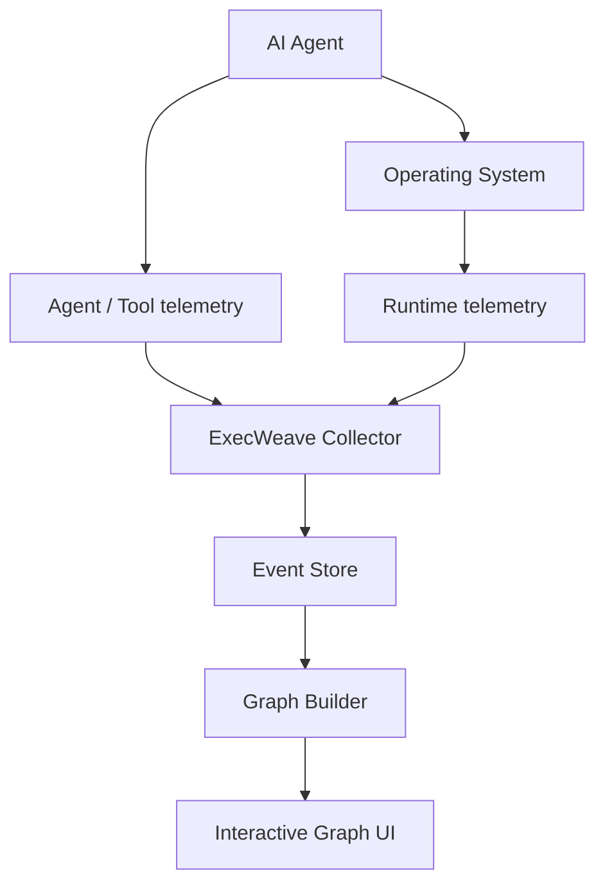

# ExecWeave

<p align="center">
  <a href="README.md">English</a> |
  <a href="README.zh-TW.md">繁體中文</a> |
  <a href="README.zh-CN.md">简体中文</a> |
  <strong>日本語</strong> |
  <a href="README.ko.md">한국어</a>
</p>

**AI Agent があなたのマシン上で実際に何をしたのかを可視化します。**

ExecWeave は、AI Agent の runtime behavior を、人間が理解しやすい interactive execution graph に変換するためのオープンソースプロジェクトです。

長い CLI 出力や大量の trace event を読む代わりに、Agent、process、command、file、network endpoint、tool、MCP server、repository、credential などの runtime resource を一つの graph に結び付けます。

> **不透明な AI Agent の実行を、人間が理解できる形にする。**

## 現在の状態

ExecWeave は **early development** 段階です。Phase 1 runtime collection には実行可能な MVP があります。

現在の collector は以下を行えます。

- Agent または任意の command を ExecWeave session として起動
- root process と descendant process の検出
- parent/child process relationship の記録
- 指定 working directory 内の filesystem change の観測
- OS が許可する範囲で process ごとの outbound network connection を観測
- 全 observation を共通 session ID を持つ graph-ready JSONL event として出力

**Interactive graph UI はまだ実装されていません。**

## Quick start

```bash
git clone https://github.com/Irish-kw/ExecWeave.git
cd ExecWeave
python -m pip install -e ".[dev]"
```

AI Agent を ExecWeave 経由で実行します。

```bash
execweave run -- claude
```

ほかにも：

```bash
execweave run -- codex
execweave run -- gemini
execweave run -- opencode
execweave run -- python my_agent.py
```

Event stream は以下に保存されます。

```text
.execweave/runs/<session-id>.jsonl
```

別の directory を監視する場合：

```bash
execweave run --watch-root /path/to/project -- claude
```

個別 collector を無効化：

```bash
execweave run --no-files -- claude
execweave run --no-network -- claude
```

Phase 1 の設計、制約、acceptance criteria は [`docs/phase-1-runtime-collection.md`](docs/phase-1-runtime-collection.md) を参照してください。

## なぜ ExecWeave が必要なのか

現代の coding agent は、一つの task 中に数百から数千の action を実行することがあります。

```text
source file を読む
→ shell command を実行
→ child process を spawn
→ package を install
→ code を変更
→ credential にアクセス
→ external service に接続
→ test を実行
→ Git を操作
```

多くのツールでは、これらは CLI output、log、trace、process tree として表示されます。

ExecWeave は別の表現を目指します。

```text
                         ┌── READ ─────→ package.json
                         │
AI Agent ──→ Shell ──────┼── SPAWN ────→ npm
    │                    │                 │
    │                    │                 └──→ node
    │                    │
    │                    └── CONNECT ──→ registry.npmjs.org
    │
    ├── READ ───────────────→ src/app.ts
    │
    ├── WRITE ──────────────→ src/app.ts
    │
    └── Git ────────────────→ github.com
```

答えたい問いはシンプルです。

> **この Agent は私のマシン上で実際に何をしたのか？**

## Graph-first event model

Phase 1 では単なる log line を保存しません。各 runtime observation を graph-ready な形式で表現します。

```text
source --RELATION--> target
```

例：

```text
session --LAUNCHED--> process
process --SPAWNED--> process
process --CONNECTED_TO--> network_endpoint
session --OBSERVED_FILE_CHANGE--> file
```

簡略化した event：

```json
{
  "schema_version": "0.1",
  "session_id": "...",
  "event_type": "network.connection",
  "relation": "CONNECTED_TO",
  "source": {
    "type": "process",
    "id": "process:1234:1780000000000000"
  },
  "target": {
    "type": "network_endpoint",
    "id": "endpoint:github.com:443"
  }
}
```

OS は PID を再利用するため、process ID には PID と process creation time の両方を含めます。

### Causality は重要です

ExecWeave は telemetry が証明できない因果関係を主張しません。

現在の filesystem watcher は、ある file が ExecWeave session 中に変更されたことは分かりますが、どの process が変更したかはまだ証明できません。そのため、この種の event は明示的に次のように記録されます。

```json
{
  "attribution": "session_observation",
  "causal": false
}
```

将来の eBPF、ETW、Endpoint Security collector では、より強い process-attributed edge を提供できます。

## Vision

ExecWeave は、単一マシン上で動く AI Agent の **live heterogeneous runtime behavior graph** を目指します。



将来の graph では、以下のような entity を接続します。

### Nodes

```text
Agent
Session
Process
Command
File
Directory
Domain
IP
Socket
Tool
MCP Server
Repository
Credential
Resource
```

### Relationships

```text
LAUNCHED
SPAWNED
EXECUTED
READ
WROTE
DELETED
CONNECTED_TO
CALLED
USED
MODIFIED
DOWNLOADED
UPLOADED
BELONGS_TO
TRIGGERED
```

## ExecWeave の違い

ExecWeave は単なる以下のツールを目指しているわけではありません。

- LLM trace viewer
- token dashboard
- prompt observability platform
- terminal recorder
- process tree
- Agent workflow visualizer

Process tree が：

```text
agent
└── bash
    └── git
        └── ssh
```

だけを示すのに対し、ExecWeave はその周囲の runtime relationship まで表現したいと考えています。

```text
                     ┌── READ ─────→ ~/.ssh/config
                     │
Agent → bash → git ──┼── USE ──────→ SSH key
                     │
                     ├── READ ─────→ repository
                     │
                     └── CONNECT ──→ github.com
```

## Roadmap

### Phase 1 — Runtime collection

- [x] 明示的な ExecWeave session の起動
- [x] graph-ready runtime event schema の定義
- [x] root process の capture
- [x] parent/child process relationship の検出
- [x] filesystem changes の観測
- [x] outbound network connections の観測
- [x] observation を一つの session ID に関連付け
- [ ] 極端に短命な process の確実な capture
- [ ] Linux process-attributed filesystem telemetry
- [ ] Windows process-attributed filesystem telemetry
- [ ] macOS process-attributed filesystem telemetry
- [ ] Runtime overhead benchmark

### Phase 2 — Execution graph

- [ ] runtime events から Graph を構築
- [ ] Entity resolution / deduplication
- [ ] Temporal graph relationships
- [ ] Graph filtering
- [ ] causal/runtime path query

### Phase 3 — Interactive UI

- [ ] Live graph updates
- [ ] Node expand/collapse
- [ ] process / file / endpoint search
- [ ] node / edge detail view
- [ ] Timeline + graph synchronization

### Phase 4 — Agent integrations

- [ ] Claude Code
- [ ] OpenAI Codex
- [ ] Gemini CLI
- [ ] OpenCode
- [ ] MCP
- [ ] Generic agent SDK / OpenTelemetry integration

### Phase 5 — Security and analysis

- [ ] Sensitive-resource detection
- [ ] Credential access detection
- [ ] Unknown-destination detection
- [ ] Behavioral comparison
- [ ] Runtime anomaly detection
- [ ] Causal provenance
- [ ] Data-flow tracking
- [ ] Execution replay
- [ ] Runtime policy / allow / warn / block

## Platform direction

最初の collector は event model を安定させるため意図的にシンプルです。

予定している telemetry source：

- **Linux:** eBPF、procfs、audit events
- **Windows:** ETW、Windows process/filesystem telemetry
- **macOS:** Endpoint Security、FSEvents、process telemetry
- **Agent layer:** agent SDK、OpenTelemetry、MCP integrations

## Privacy

ExecWeave は **local-first** を前提としています。

Runtime telemetry には file path、command-line argument、repository name、network destination、Agent prompt、secret-related metadata などの機密情報が含まれる可能性があります。

不要な収集を最小限にし、デフォルトでは telemetry をマシン外へ送信せず、可能な場合は sensitive value を redact / hash する方針です。

## Contributing

**ExecWeave への contribution を歓迎します。**

まだ早期段階なので、contributor は小さな bug fix だけでなく architecture や event model の設計にも参加できます。

特に協力を歓迎する領域：

- Linux eBPF collectors
- Windows ETW collectors
- macOS Endpoint Security collectors
- process/file/network attribution
- graph modeling / entity resolution
- interactive graph visualization
- OpenTelemetry / MCP integrations
- reproducible agent workload / tests
- performance / overhead measurement
- security research / provenance analysis
- README / documentation translation

小さな変更は fork して pull request を送ってください。大きな architecture / telemetry 変更は、platform、event source、必要な privilege、期待する graph relationship を記載した issue を先に作成することを推奨します。

### README translations

`README.md` が canonical English source です。翻訳版は `README.zh-TW.md`、`README.zh-CN.md`、`README.ja.md`、`README.ko.md` のような locale-qualified filename を使います。

新しい言語の追加も歓迎します。構造、code example、link、roadmap status、技術的意味を canonical README と同期してください。

> **Early contributors are especially welcome.**

## Design principles

### Local first

機密 runtime telemetry を第三者に upload せず Agent behavior を確認できること。

### Runtime truth over assumptions

可能な限り Agent framework の自己申告ではなく、OS 上で実際に起きたことを可視化すること。

### Graph over log

Log は重要な evidence ですが、runtime entity 間の relationship を first-class data として扱います。

### Framework agnostic

特定の model provider や Agent framework に依存しないこと。

### Explainable attribution

なぜ二つの node が接続されているのか、どの raw event がその edge を支えているのかを説明できること。

### No fake causality

Temporal correlation を causal attribution として表示しないこと。

## License

[`LICENSE`](LICENSE) を参照してください。

---

**Issue を開く。アイデアを提案する。Pull Request を送る。Integration を作る。Architecture に挑戦する。**

> **AI Agent の実行を理解できるものにしていきましょう。**
