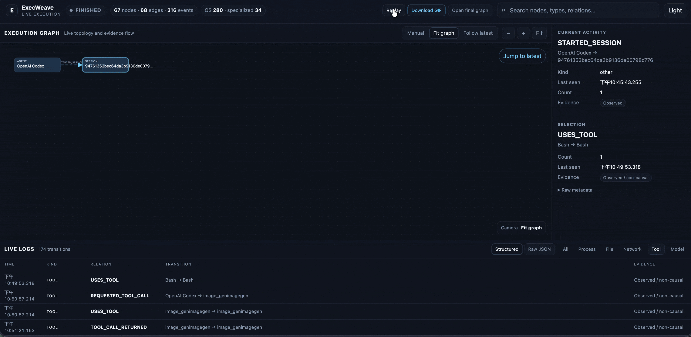

# ExecWeave

<!-- i18n-nav:start -->
<p align="center">
  <a href="README.md">English</a> |
  <a href="README.zh-TW.md">繁體中文</a> |
  <a href="README.zh-CN.md">简体中文</a> |
  <strong>日本語</strong> |
  <a href="README.ko.md">한국어</a> |
  <a href="README.fr.md">Français</a> |
  <a href="README.de.md">Deutsch</a> |
  <a href="README.ru.md">Русский</a>
</p>
<!-- i18n-nav:end -->

**AI Agent があなたのマシン上で実際に何をしているかを可視化します。**

ExecWeave は source-available、local-first の observability プロジェクトで、AI Agent の活動をインタラクティブな execution graph に変換し、observed evidence、provider content、derived inference を明確に分離します。v0.6.8 以降は PolyForm Noncommercial 1.0.0 の下で提供され、商用利用は許可されません。

> **Event が ground truth であり、Graph は materialized view です。**

<p align="center">
  
</p>

## インストール

PyPI から最新の公開 wheel/sdist をインストールします。

```bash
python -m pip install -U execweave
```

現在の `main` の package version は **v0.6.9** です。公開 release が main より遅れる場合があります。現在の mainline を直接試すには：

```bash
python -m pip install --upgrade --force-reinstall "execweave @ git+https://github.com/Irish-kw/ExecWeave.git@main"
```

開発用：

```bash
git clone https://github.com/Irish-kw/ExecWeave.git
cd ExecWeave
python -m pip install -e ".[dev]"
```

## クイックスタート

Live OS-runtime telemetry は**任意のローカルコマンド**で利用できます。以下の Agent/runtime 名は例であり、allowlist ではありません。

```bash
execweave live --open -- claude
execweave live --open -- codex
execweave live --open -- antigravity
execweave live --open -- cursor
execweave live --open -- opencode
execweave live --open -- ollama serve
execweave live --open -- python my_agent.py
```

> **Hook の許可を求められたら承認してください。** 初回の provider-integrated run では、Agent/IDE が ExecWeave のローカル Hook integration を許可するか確認する場合があります。**Allow / Yes** を選択してください。許可しなくても OS-runtime telemetry は動作する場合がありますが、provider-level の tool、model、supplied-content observability は制限または利用不可になります。

Google Antigravity は現在 `agy` CLI を使用します。ExecWeave は `antigravity` を friendly alias として受け付け、`agy` に解決します。Cursor の `execweave live --open -- cursor` はまず PATH launcher を使用し、見つからない場合は macOS/Windows の標準 Cursor desktop application binary にフォールバックします。

または finalized artifact pipeline を作成します。

```bash
execweave record --open -- python my_agent.py
```

`execweave top -- codex` は Agent を起動 terminal で対話可能なまま保持し、ホスト環境に応じて detached Top dashboard を開くか attach します。

## v0.6.9：明示的な evidence boundary を持つ full-fidelity observability

v0.6.9 は compact metadata だけでなく、対応 integration point が明示的に提供した content を保存できます。ExecWeave は**その source から提供された完全な値**をローカル SHA-256 content-addressed store に保存し、semantic event stream には reference のみを残します。

```text
<run-root>/content/sha256/<sha256>.<json|txt|bin>
```

Adapter と upstream hook/API surface に応じて、prompt/message、model request/response object、tool input/result、明示的に公開された reasoning/thinking text、shell/MCP output、provider hook が提供した file content などを保存できます。

`complete_from_source: true` は、その integration point が渡した値を ExecWeave が完全に保存したことだけを意味します。hidden model state、provider が公開しなかった内部 stage、観測していない最終 wire request、または intercept していない bytes を観測したという意味ではありません。

Full fidelity は privacy boundary も変えます。Application-level secret が content に含まれていれば、そのまま保存されます。既知の transport credential は adapter が定義する一部 provider-metadata projection から除外されますが、ExecWeave は汎用 secret scanner / content redactor ではありません。

### 対応 semantic / inference surface

| Integration | ExecWeave 配下で起動した場合の OS-runtime observation | Specialized evidence |
| --- | --- | --- |
| Claude Code | Yes | native hooks + hook が提供する full-fidelity content |
| OpenAI Codex | Yes | lifecycle hooks + hook が提供する full-fidelity content |
| Google Antigravity / Antigravity CLI | Yes | passive native hooks for invocation/tool evidence + full-fidelity values explicitly supplied to those hooks |
| Cursor | Yes | native hooks + hook が提供する full-fidelity content |
| OpenCode | Yes | project plugin + plugin が提供する full-fidelity content |
| Ollama | Yes | `execweave-model-runtime event/exchange/probe --runtime ollama` |
| llama.cpp | Yes | `execweave-model-runtime event/exchange/probe --runtime llamacpp` |
| vLLM | Yes | `execweave-model-runtime event/exchange/probe --runtime vllm` |
| LM Studio | ローカル process が ExecWeave から起動された場合のみ | `execweave-model-runtime event/exchange/probe --runtime lmstudio` |
| LiteLLM Proxy | 設定済み proxy を ExecWeave 配下で起動した場合 Yes | 現在は metadata-oriented gateway callback/event integration |
| OpenRouter | remote service process ではなく local client を観測 | `execweave-inference-gateway event/exchange/generation --gateway openrouter` |

OpenRouter `exchange` は caller-supplied request+response evidence であり、transparent wire interception ではありません。LiteLLM Proxy は現在もより限定された metadata-oriented integration です。

## Evidence layers

ExecWeave はすべての signal を一つの trace に平坦化せず、evidence layer を分離します。

```text
Agent / IDE semantic + supplied content evidence
          ↓
Inference gateway / routing evidence
          ↓
Model runtime / inference-server evidence
          ↓
OS runtime evidence: process / file / network
```

Underlying telemetry が causal claim を支える場合だけ relationship は causal です。Tool → Process bridge は保守的な derived evidence のままです。

```text
inferred: true
causal: false
```

曖昧なら edge は作成しません。Gateway と Model Runtime の exact shared request identity も causal evidence ではなく identity evidence です。

```text
identity_exact: true
inferred: false
causal: false
```

## Agent / IDE integrations

```bash
execweave-claude-hook --print-config
execweave-claude-record --open -- claude

execweave-codex-hook --print-config
execweave-codex-record --open -- codex

execweave-antigravity-hook --print-config
execweave-antigravity-record --open -- antigravity

execweave-cursor-hook --print-config
execweave-cursor-record --open -- cursor

execweave-opencode-plugin --install
execweave-opencode-record --open -- opencode
```

Provider-integrated recorder は raw runtime、semantic、correlated artifact を別々に保持します。Cursor `tool_use_id` や OpenCode `sessionID + callID` のような stable provider identifier は provider 内部の logical identity を示しますが、OS PID ではありません。Legacy Gemini CLI hook entry points は既存インストールとの互換性のため残りますが、新しい Google CLI 利用では Antigravity (`agy`) を使用してください。

## Inference gateway と model runtime

OpenRouter / LiteLLM gateway evidence：

```bash
execweave-inference-gateway event --gateway openrouter --sidecar gateway.jsonl
execweave-inference-gateway event --gateway litellm --sidecar gateway.jsonl
execweave-inference-gateway exchange --gateway openrouter --sidecar gateway.jsonl
```

Ollama、llama.cpp、vLLM、LM Studio の model-runtime evidence：

```bash
execweave-model-runtime event --runtime ollama --sidecar model-runtime.jsonl
execweave-model-runtime exchange --runtime ollama --sidecar model-runtime.jsonl
execweave-model-runtime probe --runtime ollama --sidecar model-runtime.jsonl
```

`event` は response-only evidence です。`exchange` は caller-supplied request+response object を保存し、transparent interception を主張しません。`LOADED_MODEL`、`SERVES_MODEL`、`ADVERTISES_MODEL` は source-specific semantics を持ち、互換ではありません。LM Studio の catalog visibility は `ADVERTISES_MODEL` であり、weights が memory resident である証明ではありません。

## Security analysis、evidence grades、bounded rule packs

組み込み analysis：

```bash
execweave analyze run.graph.json --output analysis.json
```

Finding は severity と独立した evidence grade を持ちます。現在は `A`、`B`、`C`、`D`、`U` で、direct syscall attribution から inferred/unknown provenance までを表します。これは evidence-strength category であり、**probability や trust score ではありません**。

Local rule pack は third-party code を実行せず、bounded で説明可能な**single-edge observation** policy を追加します。

```bash
execweave-rule-pack graph.json --rule-pack local-policy.json --output report.json
```

Rule pack は code 実行、regex/path program 定義、byte-level data flow / exfiltration claim を行えません。Rule-pack finding は observation-only のままです。

```json
{
  "data_flow_proven": false,
  "exfiltration_proven": false
}
```

## Run integrity

完了した run を seal し、regular-file inventory が seal 時点から変化していないか検証します。

```text
execweave-integrity seal .execweave/runs/<run-id>
execweave-integrity verify .execweave/runs/<run-id>
```

Deterministic manifest は file size/SHA-256 を記録し、symbolic link を拒否します。Seal 後の missing/modified/replaced/new regular file は verification failure になります。

この local seal は、evidence と manifest が同じ writable trust boundary にある場合の adversary-resistant tamper evidence ではありません。Manifest は `malicious_writer_resistance: false` と `external_trust_anchor: false` を明示します。より強い保証が必要なら manifest digest を boundary 外へコピー/保護してください。

## Runtime evidence と graph operations

Portable collector は Linux、macOS、Windows をサポートし、Linux には syscall-backed `strace` reference backend もあります。

```bash
execweave doctor
execweave run --backend portable -- your-command
execweave run --backend strace -- your-command
execweave graph-summary run.graph.json
execweave graph-focus run.graph.json NODE_ID --hops 2 --output focused.graph.json
execweave path run.graph.json SOURCE TARGET --causal-only
```

Portable filesystem observation は session-correlated であり process-causal ではなく、polling は十分短い activity を見逃す可能性があります。Linux `strace` は対応 execution でより強い process-attributed syscall evidence を提供します。Linux eBPF、Windows ETW、macOS Endpoint Security native collector は今後の計画です。

## Performance と large-run safety

v0.6.3 では bounded filesystem/viewer protection、incremental Live JSONL tailing、large-graph safety guard を追加し、v0.6.4 では detached Top と configured provider integration 用 provisional live sidecar を追加しました。これらは v0.6.9 にも残っています。本 release だけを理由に Live を SSE、artifact storage を SQLite、renderer を Canvas/WebGL、collector を Rust へ移行してはいません。

再現可能な incremental `GraphAccumulator` reference result は、文書化された GitHub Actions workload の 1M synthetic events で **164,273 ev/s** です。これは graph accumulation benchmark であり、end-to-end collector/browser throughput ではありません。

```bash
execweave-overhead --iterations 7 --strace auto --output-json benchmark-results.json
execweave-scalability
```

Reference data と methodology：[`docs/benchmarks/`](docs/benchmarks/)。

## Layered artifacts

Provider-integrated run には次のような artifact が含まれます。

```text
.execweave/runs/<run-id>/
├── events.jsonl
├── graph.json
├── viewer.html
├── semantic.jsonl
├── content/sha256/...
├── events.semantic.jsonl
├── graph.semantic.json
├── viewer.semantic.html
├── events.correlated.jsonl
├── graph.correlated.json
├── viewer.correlated.html
└── integrity.json            # explicit seal 後
```

Derived correlation は raw runtime / provider sidecar evidence を書き換えません。

## Privacy

ExecWeave は local-first であり、capture、content blob、graph、report、viewer はデフォルトでローカルに残ります。**OS runtime collector** は file content や raw read/write byte buffer を意図的に取得しません。ただし、この境界を v0.6.9 の **provider full-fidelity content store** と混同してはいけません。対応 hook/API が prompt、tool argument/result、model response、reasoning/thinking text、shell output、file content などを明示的に提供した場合、それらは完全に保存される可能性があります。

Content が secret-redacted 済みだと仮定しないでください。Command、path、endpoint metadata、identifier、model metadata、prompt、tool value、content blob はすべて sensitive になり得ます。共有前に run directory 全体を確認してください。

## 現在の状態

ExecWeave `main` は現在 **v0.6.9** で release hardening 中です。公開 package/release は main より遅れる場合があります。GitHub Release を明示的に publish した場合のみ publish workflow が動作し、PyPI upload 前に release tag と package version が完全一致することを検証します。

v0.6.9 は cross-platform runtime collection、materialized execution graph、standalone/live viewer、保守的 provider↔runtime correlation、content-addressed full-fidelity provider evidence、evidence grades、bounded rule packs、明示的 runtime threat/fidelity contract、honest local run-integrity sealing を組み合わせています。Observed evidence と inference は設計上分離されています。

## ドキュメント

- [`Phase 1 — Runtime Collection`](docs/phase-1-runtime-collection.ja.md)
- [`Phase 2 — Execution Graph`](docs/phase-2-execution-graph.ja.md)
- [`Live Graph`](docs/live-graph.ja.md)
- [`Semantic Telemetry`](docs/semantic-telemetry.ja.md)
- [`Claude Code Hooks`](docs/claude-code-hooks.ja.md)
- [`OpenAI Codex Hooks`](docs/codex-hooks.ja.md)
- [`Google Antigravity Hooks`](docs/antigravity-hooks.md)
- [`Cursor Hooks`](docs/cursor-hooks.ja.md)
- [`OpenCode Plugin`](docs/opencode-plugin.ja.md)
- [`Inference Gateway / OpenRouter / LiteLLM`](docs/inference-gateway.ja.md)
- [`Model Runtime / Ollama / llama.cpp / vLLM / LM Studio`](docs/model-runtime.ja.md)
- [`Runtime Threat Model`](docs/runtime-threat-model.ja.md)
- [`Evidence Grades`](docs/evidence-grades.ja.md)
- [`Rule Packs`](docs/rule-packs.ja.md)
- [`Run Integrity`](docs/run-integrity.ja.md)
- [`Security Analysis`](docs/security-analysis.ja.md)
- [`Performance Benchmarks`](docs/benchmarks/README.md)

## コントリビューション

特に native OS collector、Agent/IDE adapter、inference gateway、model runtime、evidence/correlation method、privacy/redaction、graph UX、performance evaluation への contribution を歓迎します。

## License

ExecWeave v0.6.8 以降は **PolyForm Noncommercial License 1.0.0** の下で提供されます。非商用の利用・変更・再配布はその条件に従って許可されますが、商用利用には別途書面による商用ライセンスが必要です。以前に MIT で公開済みの旧バージョンは当時のライセンス条件のままです。詳しくは [`LICENSE`](LICENSE) を参照してください。
