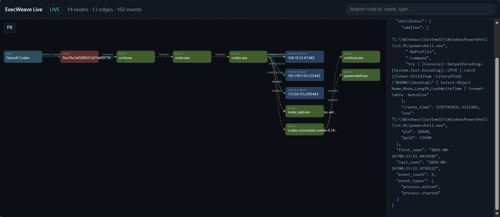

# ExecWeave

<p align="center">
  <a href="README.md">English</a> |
  <a href="README.zh-TW.md">繁體中文</a> |
  <a href="README.zh-CN.md">简体中文</a> |
  <a href="README.ja.md">日本語</a> |
  <strong>한국어</strong>
</p>

**AI 에이전트가 실제로 머신에서 무엇을 했는지 확인하세요.**

ExecWeave는 AI 에이전트 활동을 인터랙티브 execution graph로 변환하는 local-first 오픈소스 observability 프로젝트입니다. Observed evidence와 inference를 명확히 분리합니다.

> **Event is ground truth. The graph is a materialized view.**

<p align="center">
  
</p>

## Installation

ExecWeave는 PyPI에 정식 공개되어 있습니다. 최신 공개 release 설치:

```bash
python -m pip install -U execweave
```

`main`은 현재 PyPI release보다 더 새로운 patch를 포함할 수 있습니다. 최신 mainline을 직접 테스트하려면:

```bash
python -m pip install --upgrade --force-reinstall "execweave @ git+https://github.com/Irish-kw/ExecWeave.git@main"
```

개발 설치:

```bash
git clone https://github.com/Irish-kw/ExecWeave.git
cd ExecWeave
python -m pip install -e ".[dev]"
```

Live OS-runtime telemetry는 **모든 로컬 command**에 사용할 수 있습니다. 아래 항목은 whitelist가 아니라 예시입니다:

```bash
# Agent / IDE CLI
execweave live --open -- claude
execweave live --open -- codex
execweave live --open -- gemini
execweave live --open -- cursor
execweave live --open -- opencode

# 임의의 로컬 프로그램
execweave live --open -- python my_agent.py

# ExecWeave가 시작하는 로컬 model runtime
execweave live --open -- ollama serve
```

`execweave live`는 자신이 시작한 command tree의 process, file, network evidence를 실시간으로 보여 줍니다. Agent semantic hooks, model-runtime API metadata, inference-gateway routing metadata는 **현재 Live Viewer에 자동으로 주입되지 않습니다**.

#### Live capability matrix

| Integration | Direct OS-runtime live | Specialized metadata | Auto in Live Viewer |
| --- | --- | --- | --- |
| Claude Code | Yes | `execweave-claude-record` / hooks | No |
| OpenAI Codex | Yes | `execweave-codex-record` / hooks | No |
| Gemini CLI | Yes | `execweave-gemini-record` / hooks | No |
| Cursor | Yes | `execweave-cursor-record` / hooks | No |
| OpenCode | Yes | `execweave-opencode-record` / plugin | No |
| Ollama | Yes, ExecWeave가 시작한 경우(예: `ollama serve`) | `execweave-model-runtime event/probe --runtime ollama` | No |
| llama.cpp | Yes, 로컬 server를 ExecWeave가 시작한 경우 | `execweave-model-runtime event/probe --runtime llamacpp` | No |
| vLLM | Yes, 로컬 server를 ExecWeave가 시작한 경우 | `execweave-model-runtime event/probe --runtime vllm` | No |
| LM Studio | ExecWeave가 시작한 로컬 process만 가능하며 기존 server에는 attach하지 않음 | `execweave-model-runtime event/probe --runtime lmstudio` | No |
| LiteLLM Proxy | Yes, 로컬 proxy를 ExecWeave가 시작한 경우 | `execweave-inference-gateway event --gateway litellm` | No |
| OpenRouter | Remote service 자체는 direct live 불가. 로컬 client/Agent를 live해야 함 | `execweave-inference-gateway event/generation --gateway openrouter` | No |

Ollama가 이미 백그라운드에서 실행 중이면 `execweave-model-runtime probe --runtime ollama`로 loaded-model state를 snapshot할 수 있습니다. OpenRouter에서는 `live`가 로컬 client와 network activity를 관측하고 gateway routing/usage metadata는 별도 evidence layer로 유지됩니다.

<!-- v0.6.3-live -->
### v0.6.3 라이브 관측성

동일한 live session을 브라우저 또는 Terminal에서 확인할 수 있습니다:

```bash
execweave top -- codex          # Terminal dashboard
execweave top --open -- codex   # Terminal + Web Viewer
```

Live 업데이트는 증분 snapshot/delta와 제한된 이력을 사용하므로 전체 graph를 반복해서 재구성하고 전송하지 않습니다. Live 및 standalone Viewer는 선택을 기억하는 Dark/Light 전환을 지원합니다. Linux에서는 매우 큰 recursive filesystem scope를 사전 점검하고 inotify watch 용량이 부족하면 자동으로 polling으로 전환하므로 inotify watch exhaustion 때문에 session 전체가 중단되지 않습니다.

`live`는 일반 OS-runtime view이며 integration whitelist가 아닙니다. Agent semantic, model-runtime, gateway metadata는 분리된 evidence layer로 유지되며 v0.6.3에서는 Live Viewer에 자동으로 주입되지 않습니다.

`execweave-scalability`로 graph scalability benchmark를 재현할 수 있으며 CI는 10k, 100k, 1M synthetic events를 검증합니다.

#### Scalability benchmark

GitHub Actions에서 실행한 incremental `GraphAccumulator` synthetic workload의 reference result입니다 (`retain_event_ids=False`):

| Events | Apply time | Throughput | Nodes | Edges | Apply RSS Δ | Snapshot |
| ---: | ---: | ---: | ---: | ---: | ---: | ---: |
| 10k | 0.114 s | 87,681 ev/s | 10,001 | 10,000 | 35.9 MiB | 8.5 MiB |
| 100k | 0.654 s | 152,816 ev/s | 10,001 | 10,000 | 25.8 MiB | 8.6 MiB |
| **1M** | **6.087 s** | **164,273 ev/s** | **10,001** | **10,000** | **23.5 MiB** | **8.6 MiB** |

**1,000,000 events**에서 incremental in-memory graph는 raw event IDs를 중복 보관하지 않으며, raw evidence는 materialized graph와 분리된 상태로 유지됩니다. 이 benchmark는 graph accumulation과 snapshot materialization을 측정하며 end-to-end collector 또는 browser throughput을 의미하지 않습니다.

## Performance / footprint

Reference benchmark는 editable source가 아니라 실제 설치된 wheel에서 실행됩니다. X축은 additional peak process-tree RSS, Y축은 runtime overhead, bubble 면적은 run당 median artifact size입니다. 두 축 모두 낮음→높음이며 왼쪽 아래가 선호 영역입니다.


Reference environment: GitHub Actions Ubuntu runner, Intel Xeon Platinum 8573C, 4 logical CPUs, Python 3.12.14, `n=7`.

| Profile | Median wall time | Runtime overhead | Additional peak RSS | Median artifacts/run |
| --- | ---: | ---: | ---: | ---: |
| ExecWeave OFF | 236.221 ms | 0.0% | 0.0 MB | 0 KB |
| Portable ON | 391.580 ms | 65.768% | 27.852 MB | 741.355 KB |
| Strace ON | 1226.076 ms | 419.038% | 37.653 MB | 572.838 KB |

같은 build에서 wheel은 약 **113 KB**, sdist는 약 **198 KB**, 설치된 ExecWeave distribution은 약 **849 KB**였습니다. Python과 dependency footprint는 제외합니다.

이 수치는 매우 짧고 file/process-heavy한 **reference microbenchmark** 결과이며 모든 Agent workload에 대한 일반적 overhead 주장이 아닙니다. 실제 배포 전 target host와 대표 workload에서 다시 실행해야 합니다.

```bash
execweave-overhead --iterations 7 --strace auto \
  --output-json benchmark-results.json \
  --output-svg benchmark-overhead.svg
```

Raw data / methodology: [`docs/benchmarks/`](docs/benchmarks/).

## Evidence layers

```text
Agent / IDE semantic evidence
          ↓
Inference gateway / routing evidence
          ↓
Model runtime / inference-server evidence
          ↓
OS runtime evidence: process / file / network
```

기반 telemetry가 직접 뒷받침할 때만 relationship을 causal이라고 표시합니다.

## Integrations

Agent / IDE: Claude Code, OpenAI Codex, Gemini CLI, Cursor, OpenCode.

Inference Gateway: OpenRouter, LiteLLM Proxy. Requested model / resolved model / provider / deployment을 서로 다른 evidence로 보존하며 authoritative metadata가 없으면 routing fact를 추측하지 않습니다.

Model Runtime: Ollama, llama.cpp, vLLM, LM Studio. Prompt / generated content / reasoning content는 저장하지 않습니다. Sensitive local model path는 redact합니다. LM Studio catalog는 `ADVERTISES_MODEL`로 표현하며 catalog visibility를 loaded-memory evidence로 간주하지 않습니다.

Tool → Process correlation은 항상:

```text
inferred: true
causal: false
```

ambiguous / no-match이면 edge를 만들지 않습니다.

Gateway와 Model Runtime 양쪽에 명시적 shared request identity가 있을 때만 `SAME_INFERENCE_REQUEST`를 생성할 수 있습니다:

```text
identity_exact: true
inferred: false
causal: false
```

Raw shared ID는 저장하지 않고 SHA-256-derived identity hash만 보존합니다.

## Runtime evidence

Portable collector는 Linux / macOS / Windows에서 동작하고 Linux에는 syscall-backed `strace` reference backend가 있습니다.

```bash
execweave doctor
execweave run --backend portable -- your-command
execweave run --backend strace -- your-command
```

v0.6.1부터 모든 recorder는 child command 실행 전에 공통 cross-platform launcher resolver를 사용합니다. Linux / macOS는 일반적인 PATH executable 동작을 유지합니다. Windows는 PATH/PATHEXT를 통해 `.exe`, `.cmd`, `.bat`를 올바르게 해석하고, 명시적인 `.ps1`은 PowerShell로 실행합니다. 전용 Windows CI는 `cmd.exe`와 Windows PowerShell 양쪽에서 Codex / Cursor recorder를 실제 실행하며, 일반 Windows / macOS / Ubuntu matrix에서도 Cursor semantic/correlation integration을 계속 검증합니다.

Portable filesystem observation은 process-causal이 아니라 session-correlated입니다. Future native collectors는 Linux eBPF, Windows ETW, macOS Endpoint Security를 계획하고 있습니다.

## v0.6.3 Safety Patch

v0.6.3는 long-running / high-cardinality session의 resource safety를 강화하지만 **evidence semantics와 graph schema 0.1은 변경하지 않습니다**.

- filesystem root, user home, users-home parent처럼 지나치게 넓은 recursive scope에서는 recursive filesystem observation을 그대로 시작하지 않으며 process / network / semantic collection은 계속할 수 있습니다.
- Standalone / Live Viewer가 safety budget(1,500 nodes, 4,000 edges 또는 추정 5,000 SVG elements)을 초과하면 SVG materialization을 중단해 browser memory exhaustion을 방지합니다. Canonical `graph.json` evidence artifact는 완전하게 유지됩니다.
- Viewer layout/fit은 임의로 큰 array를 `Math.min` / `Math.max`에 spread하지 않으며 node drag 중 edge redraw는 animation-frame throttling됩니다.
- Live server는 byte offset 이후의 `events.jsonl` 추가 bytes만 tail하고 in-memory `GraphAccumulator`를 incremental하게 갱신합니다. 각 `/graph.json` request에서 전체 event history를 다시 replay하지 않으며 newline이 없는 trailing partial JSONL line은 buffer합니다.
- event count / aggregate count만 바뀌면 stats/edge labels만 갱신하고 full topology redraw를 하지 않습니다. Viewer budget을 넘은 뒤 live `/graph.json`은 counts-only compact payload를 반환하며 collection과 session 종료 시 canonical validation/full `graph.json`은 그대로 유지됩니다.

이것은 polling + incremental ingestion Safety Patch이며 SSE, SQLite, Rust, Canvas architecture migration은 아닙니다.

## Viewer / Graph / Security

Standalone Viewer는 local self-contained이며 pan/zoom, inspection, filters, **observed only**, search, Timeline replay, cluster expansion, focused neighborhood, Saved Views, 명시적 edge semantics를 지원합니다.

```bash
execweave graph-summary run.graph.json
execweave graph-focus run.graph.json NODE_ID --hops 2 --output focused.graph.json
execweave analyze run.graph.json --output analysis.json
```

Security findings는 evidence limit를 유지하며 possible sensitive-file → network path를 byte-level exfiltration 증명으로 취급하지 않습니다.

## Current status

ExecWeave `main`은 현재 **v0.6.3**입니다. Runtime collection, execution graph, 5개 Agent/IDE integration, OpenRouter/LiteLLM, Ollama/llama.cpp/vLLM/LM Studio, exact Gateway ↔ Runtime identity, 공개된 PyPI packaging, reference overhead benchmark, cross-platform command-launcher compatibility, large-graph browser safety guards, incremental Live JSONL tail/cache, cross-platform CI가 baseline에 포함됩니다.

## Privacy

ExecWeave는 local-first입니다. Runtime events, semantic sidecars, graphs, reports, Viewers는 기본적으로 로컬에 남습니다. File content나 raw read/write buffers를 의도적으로 수집하지 않습니다. Artifact를 공유하기 전에 command, path, endpoint, identifier, model metadata를 검토하세요.

## Documentation

- [`Phase 1 — Runtime Collection`](docs/phase-1-runtime-collection.ko.md)
- [`Phase 2 — Execution Graph`](docs/phase-2-execution-graph.ko.md)
- [`Semantic Telemetry`](docs/semantic-telemetry.ko.md)
- [`Inference Gateway`](docs/inference-gateway.ko.md)
- [`Model Runtime`](docs/model-runtime.ko.md)
- [`Performance Benchmarks`](docs/benchmarks/README.md)
- [`Security Analysis`](docs/security-analysis.ko.md)

## License

[`LICENSE`](LICENSE)를 참조하세요.