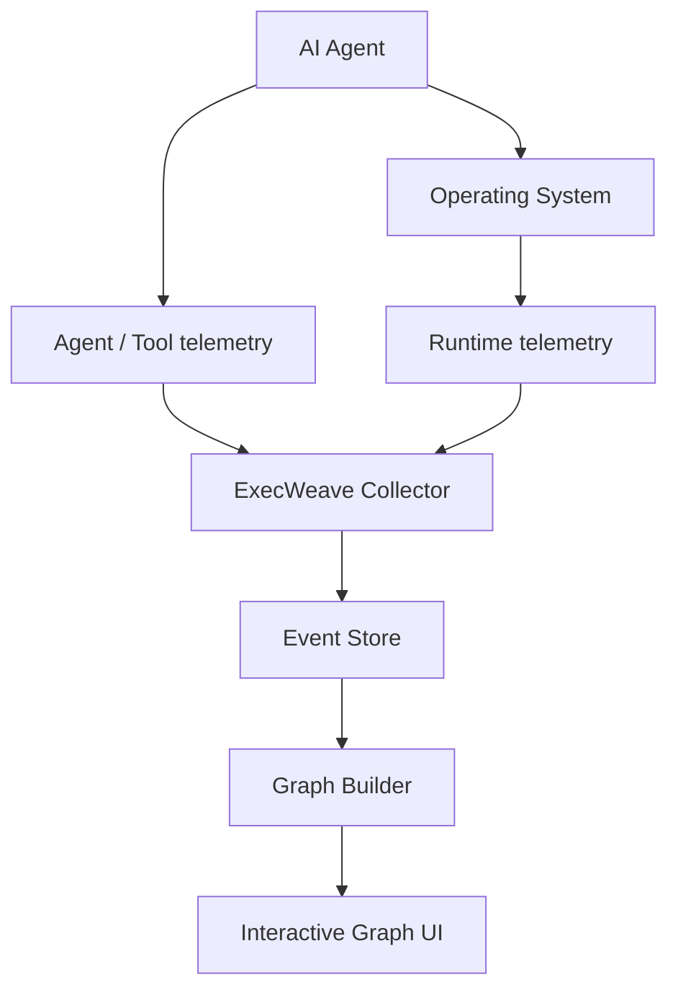

# ExecWeave

<p align="center">
  <a href="README.md">English</a> |
  <a href="README.zh-TW.md">繁體中文</a> |
  <a href="README.zh-CN.md">简体中文</a> |
  <a href="README.ja.md">日本語</a> |
  <strong>한국어</strong>
</p>

**AI Agent가 내 컴퓨터에서 실제로 무엇을 했는지 확인하세요.**

ExecWeave는 AI Agent의 runtime behavior를 사람이 이해하기 쉬운 interactive execution graph로 변환하기 위한 오픈소스 프로젝트입니다.

긴 CLI 출력이나 수천 개의 trace event를 읽는 대신, Agent, process, command, file, network endpoint, tool, MCP server, repository, credential 및 기타 runtime resource를 하나의 이해 가능한 graph로 연결하는 것을 목표로 합니다.

> **불투명한 AI Agent 실행을 사람이 이해할 수 있는 형태로 바꿉니다.**

## 현재 상태

ExecWeave는 아직 **early development** 단계입니다. Phase 1 runtime collection에는 실행 가능한 MVP가 있습니다.

현재 collector는 다음을 수행할 수 있습니다.

- Agent 또는 임의의 command를 ExecWeave session으로 실행
- root process와 descendant process 탐지
- parent/child process relationship 기록
- 지정한 working directory의 filesystem 변경 관찰
- OS가 허용하는 경우 process별 outbound network connection 관찰
- 모든 observation을 동일한 session ID를 공유하는 graph-ready JSONL event로 출력

현재 **interactive graph UI는 아직 구현되지 않았습니다.**

## Quick start

```bash
git clone https://github.com/Irish-kw/ExecWeave.git
cd ExecWeave
python -m pip install -e ".[dev]"
```

ExecWeave 아래에서 AI Agent를 실행합니다.

```bash
execweave run -- claude
```

또는:

```bash
execweave run -- codex
execweave run -- gemini
execweave run -- opencode
execweave run -- python my_agent.py
```

로컬 event stream은 다음 위치에 저장됩니다.

```text
.execweave/runs/<session-id>.jsonl
```

다른 directory를 관찰하려면:

```bash
execweave run --watch-root /path/to/project -- claude
```

개별 collector 비활성화:

```bash
execweave run --no-files -- claude
execweave run --no-network -- claude
```

Phase 1 설계, 제한 사항 및 acceptance criteria는 [`docs/phase-1-runtime-collection.md`](docs/phase-1-runtime-collection.md)를 참고하세요.

## 왜 ExecWeave가 필요한가요?

현대의 coding agent는 하나의 task에서 수백 또는 수천 개의 action을 수행할 수 있습니다.

```text
source file 읽기
→ shell command 실행
→ child process 생성
→ package 설치
→ code 수정
→ credential 접근
→ external service 연결
→ test 실행
→ Git 조작
```

대부분의 도구는 이러한 동작을 CLI output, log, trace 또는 process tree 형태로 보여줍니다.

ExecWeave는 다른 표현 방식을 지향합니다.

```text
                         ┌── READ ─────→ package.json
                         │
AI Agent ──→ Shell ──────┼── SPAWN ────→ npm
    │                    │                 │
    │                    │                 └──→ node
    │                    │
    │                    └── CONNECT ──→ registry.npmjs.org
    │
    ├── READ ───────────────→ src/app.ts
    │
    ├── WRITE ──────────────→ src/app.ts
    │
    └── Git ────────────────→ github.com
```

우리가 답하고 싶은 질문은 단순합니다.

> **이 Agent가 내 컴퓨터에서 실제로 무엇을 했는가?**

## Graph-first event model

Phase 1은 단순한 임의 형식의 log line을 저장하지 않습니다. 각 runtime observation은 graph-ready 형식으로 표현됩니다.

```text
source --RELATION--> target
```

예시:

```text
session --LAUNCHED--> process
process --SPAWNED--> process
process --CONNECTED_TO--> network_endpoint
session --OBSERVED_FILE_CHANGE--> file
```

단순화된 event 예시:

```json
{
  "schema_version": "0.1",
  "session_id": "...",
  "event_type": "network.connection",
  "relation": "CONNECTED_TO",
  "source": {
    "type": "process",
    "id": "process:1234:1780000000000000"
  },
  "target": {
    "type": "network_endpoint",
    "id": "endpoint:github.com:443"
  }
}
```

운영체제는 PID를 재사용하므로 process ID에는 PID와 process creation time을 함께 포함합니다.

### Causality는 중요합니다

ExecWeave는 telemetry가 증명할 수 없는 인과관계를 주장하지 않습니다.

현재 filesystem watcher는 파일이 ExecWeave session 중 변경되었다는 사실은 알 수 있지만, 어떤 process가 변경했는지는 아직 증명할 수 없습니다. 따라서 해당 event는 다음과 같이 명시됩니다.

```json
{
  "attribution": "session_observation",
  "causal": false
}
```

향후 eBPF, ETW, Endpoint Security collector는 더 강한 process-attributed edge를 제공할 수 있습니다.

## Vision

ExecWeave는 단일 컴퓨터에서 실행되는 AI Agent를 위한 **live heterogeneous runtime behavior graph**를 목표로 합니다.



장기적으로 graph는 다음 entity를 연결할 수 있습니다.

### Nodes

```text
Agent
Session
Process
Command
File
Directory
Domain
IP
Socket
Tool
MCP Server
Repository
Credential
Resource
```

### Relationships

```text
LAUNCHED
SPAWNED
EXECUTED
READ
WROTE
DELETED
CONNECTED_TO
CALLED
USED
MODIFIED
DOWNLOADED
UPLOADED
BELONGS_TO
TRIGGERED
```

## ExecWeave는 무엇이 다른가요?

ExecWeave는 단순히 또 하나의 다음 도구가 되는 것을 목표로 하지 않습니다.

- LLM trace viewer
- token dashboard
- prompt observability platform
- terminal recorder
- process tree
- Agent workflow visualizer

일반적인 process tree가 다음처럼 보인다면:

```text
agent
└── bash
    └── git
        └── ssh
```

ExecWeave는 해당 process 주변의 실제 runtime relationship까지 보여주는 것을 목표로 합니다.

```text
                     ┌── READ ─────→ ~/.ssh/config
                     │
Agent → bash → git ──┼── USE ──────→ SSH key
                     │
                     ├── READ ─────→ repository
                     │
                     └── CONNECT ──→ github.com
```

## Roadmap

### Phase 1 — Runtime collection

- [x] 명시적인 ExecWeave session 시작
- [x] graph-ready runtime event schema 정의
- [x] root process capture
- [x] parent/child process relationship 탐지
- [x] filesystem changes 관찰
- [x] outbound network connections 관찰
- [x] observation을 하나의 session ID로 연결
- [ ] 매우 짧게 실행되는 process 안정적 capture
- [ ] Linux process-attributed filesystem telemetry
- [ ] Windows process-attributed filesystem telemetry
- [ ] macOS process-attributed filesystem telemetry
- [ ] Runtime overhead benchmark

### Phase 2 — Execution graph

- [ ] runtime events를 Graph로 구성
- [ ] Entity resolution / deduplication
- [ ] Temporal graph relationships
- [ ] Graph filtering
- [ ] causal/runtime path query

### Phase 3 — Interactive UI

- [ ] Live graph updates
- [ ] Node expand/collapse
- [ ] process / file / endpoint 검색
- [ ] node / edge 상세 보기
- [ ] Timeline + graph synchronization

### Phase 4 — Agent integrations

- [ ] Claude Code
- [ ] OpenAI Codex
- [ ] Gemini CLI
- [ ] OpenCode
- [ ] MCP
- [ ] Generic agent SDK / OpenTelemetry integration

### Phase 5 — Security and analysis

- [ ] Sensitive-resource detection
- [ ] Credential access detection
- [ ] Unknown-destination detection
- [ ] Behavioral comparison
- [ ] Runtime anomaly detection
- [ ] Causal provenance
- [ ] Data-flow tracking
- [ ] Execution replay
- [ ] Runtime policy / allow / warn / block

## Platform direction

첫 collector는 event model을 안정화하기 위해 의도적으로 단순하게 설계되었습니다.

계획 중인 telemetry source:

- **Linux:** eBPF, procfs, audit events
- **Windows:** ETW, Windows process/filesystem telemetry
- **macOS:** Endpoint Security, FSEvents, process telemetry
- **Agent layer:** agent SDK, OpenTelemetry, MCP integrations

## Privacy

ExecWeave는 **local-first**를 지향합니다.

Runtime telemetry에는 file path, command-line argument, repository name, network destination, Agent prompt, secret-related metadata 등 민감한 정보가 포함될 수 있습니다.

불필요한 수집을 최소화하고 기본적으로 telemetry를 컴퓨터 밖으로 전송하지 않으며, 가능한 경우 sensitive value를 redact 또는 hash해야 합니다.

## Contributing

**ExecWeave에 대한 contribution을 환영합니다.**

아직 초기 단계이기 때문에 contributor는 작은 bug fix뿐 아니라 architecture와 event model 설계에도 직접 참여할 수 있습니다.

특히 도움이 필요한 분야:

- Linux eBPF collectors
- Windows ETW collectors
- macOS Endpoint Security collectors
- process/file/network attribution
- graph modeling / entity resolution
- interactive graph visualization
- OpenTelemetry / MCP integrations
- reproducible agent workload / tests
- performance / overhead measurement
- security research / provenance analysis
- README / documentation translations

작은 변경은 repository를 fork한 뒤 pull request를 보내주세요. 큰 architecture 또는 telemetry 변경은 platform, event source, 필요한 privilege, 예상 graph relationship을 설명하는 issue를 먼저 열어 주세요.

### README translations

`README.md`는 canonical English source입니다. 번역본은 `README.zh-TW.md`, `README.zh-CN.md`, `README.ja.md`, `README.ko.md`와 같은 locale-qualified filename을 사용합니다.

새로운 언어 추가도 환영합니다. 구조, code example, link, roadmap status, 기술적 의미를 canonical README와 동기화해 주세요.

> **Early contributors are especially welcome.**

## Design principles

### Local first

민감한 runtime telemetry를 제3자에게 업로드하지 않고 Agent behavior를 확인할 수 있어야 합니다.

### Runtime truth over assumptions

가능한 한 Agent framework의 주장보다 운영체제에서 실제로 발생한 사실을 우선적으로 보여줍니다.

### Graph over log

Log는 중요한 evidence이지만 runtime entity 간 relationship은 first-class data여야 합니다.

### Framework agnostic

특정 model provider나 Agent framework에 종속되지 않아야 합니다.

### Explainable attribution

두 node가 왜 연결되었는지, 어떤 raw event가 해당 edge를 뒷받침하는지 설명할 수 있어야 합니다.

### No fake causality

Temporal correlation을 causal attribution처럼 표시하지 않습니다.

## License

[`LICENSE`](LICENSE)를 참고하세요.

---

**Issue를 열고, 아이디어를 제안하고, Pull Request를 보내고, Integration을 만들고, Architecture에 도전하세요.**

> **AI Agent 실행을 사람이 이해할 수 있게 만듭시다.**
