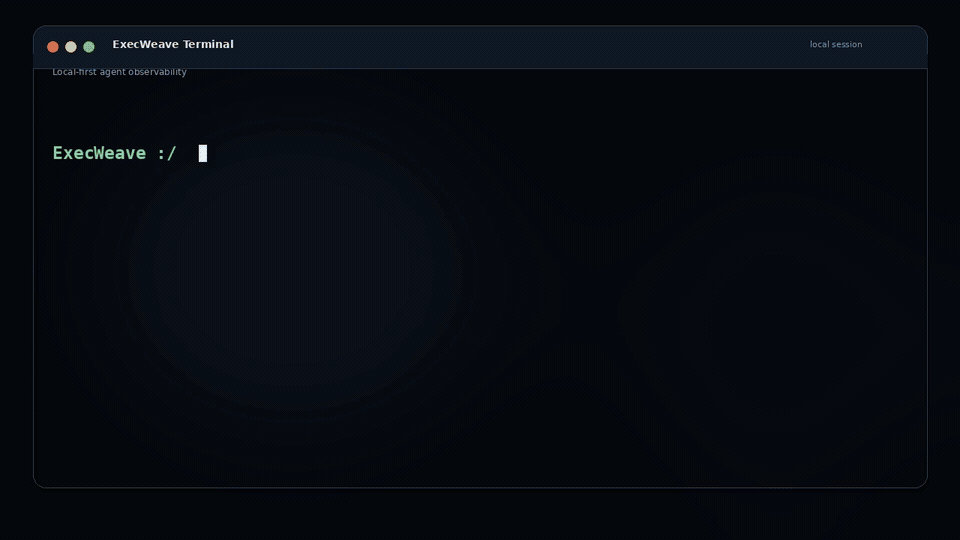
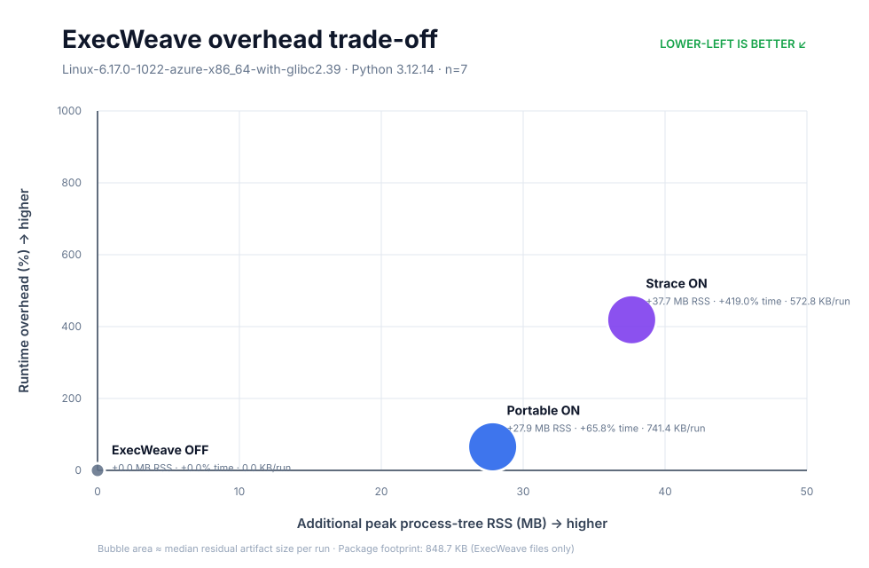

# ExecWeave

<!-- i18n-nav:start -->
<p align="center">
  <strong>English</strong> |
  <a href="README.zh-TW.md">繁體中文</a> |
  <a href="README.zh-CN.md">简体中文</a> |
  <a href="README.ja.md">日本語</a> |
  <a href="README.ko.md">한국어</a> |
  <a href="README.fr.md">Français</a> |
  <a href="README.de.md">Deutsch</a> |
  <a href="README.ru.md">Русский</a>
</p>
<!-- i18n-nav:end -->

**See what AI agents actually do on your machine.**

ExecWeave is an open-source, local-first observability project that turns AI-agent activity into an interactive execution graph while keeping observed evidence separate from inference.

> **Event is ground truth. The graph is a materialized view.**

<p align="center">
  
</p>

<!-- execweave-demo:start -->
## Reproduce this demo

The animation above is a real ExecWeave v0.6.3 live session. This workload deliberately creates enough activity to make the execution graph useful: multiple Python modules, JSON/CSV files, tests, file inspection, and outbound HTTP requests.

Run a local Agent CLI under ExecWeave. For example:

```bash
execweave live --open -- claude
```

Then paste this workload prompt into the Agent:

```text
Create a small Python project in ./execweave-demo with 8 modules,
generate sample JSON and CSV data, run the program and tests,
inspect the generated files, and fetch example.com plus the GitHub API.
```
The same workload works with `codex`, `gemini`, `cursor`, or `opencode`. Exact node, edge, event, process, and endpoint counts vary by OS, Agent version, and environment. ExecWeave records observed runtime evidence; the animation is one concrete run, not a fixed expected graph.
<!-- execweave-demo:end -->

## Install

ExecWeave is published on PyPI as a standard Python wheel/sdist. Install the latest published release with:

```bash
python -m pip install -U execweave
```

The `main` branch may contain a newer patch than the current PyPI release. To test the latest mainline build directly:

```bash
python -m pip install --upgrade --force-reinstall "execweave @ git+https://github.com/Irish-kw/ExecWeave.git@main"
```

For development:

```bash
git clone https://github.com/Irish-kw/ExecWeave.git
cd ExecWeave
python -m pip install -e ".[dev]"
```

Live OS-runtime telemetry works with **any local command**. The names below are examples, not a whitelist:

```bash
# Agent / IDE CLIs
execweave live --open -- claude
execweave live --open -- codex
execweave live --open -- gemini
execweave live --open -- cursor
execweave live --open -- opencode

# Any local program
execweave live --open -- python my_agent.py

# A local model runtime launched under ExecWeave
execweave live --open -- ollama serve
```

`execweave live` streams process, file, and network evidence for the command tree it launches. In v0.6.4, configured Claude/Codex/Gemini/Cursor hooks and the OpenCode plugin automatically feed the per-run live sidecar. Ollama, llama.cpp, and vLLM server launches also receive automatic local model-catalog probes.

#### Live capability matrix

| Integration | Direct OS-runtime live | Specialized metadata | Automatically in Live Viewer |
| --- | --- | --- | --- |
| Claude Code | Yes | `execweave-claude-record` / hooks | Yes (configured hook/plugin) |
| OpenAI Codex | Yes | `execweave-codex-record` / hooks | Yes (configured hook/plugin) |
| Gemini CLI | Yes | `execweave-gemini-record` / hooks | Yes (configured hook/plugin) |
| Cursor | Yes | `execweave-cursor-record` / hooks | Yes (configured hook/plugin) |
| OpenCode | Yes | `execweave-opencode-record` / plugin | Yes (configured hook/plugin) |
| Ollama | Yes, when launched under ExecWeave (for example `ollama serve`) | `execweave-model-runtime event/probe --runtime ollama` | Yes (automatic local probe) |
| llama.cpp | Yes, when its local server is launched under ExecWeave | `execweave-model-runtime event/probe --runtime llamacpp` | Yes (automatic local probe) |
| vLLM | Yes, when its local server is launched under ExecWeave | `execweave-model-runtime event/probe --runtime vllm` | Yes (automatic local probe) |
| LM Studio | Yes only for a local process launched under ExecWeave; an already-running server is not attached | `execweave-model-runtime event/probe --runtime lmstudio` | No |
| LiteLLM Proxy | Yes, when the local proxy is launched under ExecWeave | `execweave-inference-gateway event --gateway litellm` | No |
| OpenRouter | No direct remote-service process; run the local client/Agent under `live` instead | `execweave-inference-gateway event/generation --gateway openrouter` | No |

Agent rows marked **Yes** require the provider hook/plugin to be configured once; `execweave live` then supplies the per-run `EXECWEAVE_SEMANTIC_SIDECAR` automatically. Ollama, llama.cpp, and vLLM rows marked **Yes** use automatic loopback model-catalog probes only when ExecWeave launches the corresponding local server. LM Studio and inference-gateway rows remain **No** until their specialized metadata can be observed automatically without inventing evidence.

For an already-running Ollama server, use `execweave-model-runtime probe --runtime ollama` to snapshot loaded-model state. For OpenRouter, `live` can observe the local client and its network activity, while gateway routing/usage metadata remains a separate evidence layer.

<!-- v0.6.4-live -->
### v0.6.4 live observability

`top` keeps the Agent fully interactive in the terminal where you launched it and opens the dashboard in a **separate terminal window**:

```bash
execweave top -- codex          # Agent here + detached Top dashboard
execweave top --open -- codex   # Agent here + detached Top dashboard + Web Viewer
```

The detached dashboard is an attach-only client for the same localhost live session; it never launches a second Agent process. On Windows it uses a new console, on macOS it opens Terminal, and on desktop Linux it uses an available terminal emulator. In a headless environment, ExecWeave prints an attach command instead of taking over the Agent terminal.

Live updates use incremental snapshots/deltas with bounded history instead of repeatedly rebuilding and transferring the full graph. Live and standalone viewers support a persistent Dark/Light theme switch. On Linux, very large recursive filesystem scopes are preflighted and automatically fall back from inotify to polling when needed, so an exhausted inotify watch pool does not abort the session.

v0.6.4 gives each live run a shared specialized-evidence sidecar. Configured Claude Code, Codex, Gemini CLI, Cursor, and OpenCode integrations inherit that sidecar automatically, so their provider semantic evidence can appear incrementally beside OS-runtime evidence in the same live graph. This live normalization is provisional; after the command exits, the final graph is rebuilt from the canonical runtime + semantic merge. Missing specialized evidence is never invented.

Run the reproducible graph scalability benchmark with `execweave-scalability`; CI covers 10k, 100k, and 1M synthetic events.

#### Scalability benchmark

Reference GitHub Actions result for the incremental `GraphAccumulator` synthetic workload (`retain_event_ids=False`):

| Events | Apply time | Throughput | Nodes | Edges | Apply RSS Δ | Snapshot |
| ---: | ---: | ---: | ---: | ---: | ---: | ---: |
| 10k | 0.114 s | 87,681 ev/s | 10,001 | 10,000 | 35.9 MiB | 8.5 MiB |
| 100k | 0.654 s | 152,816 ev/s | 10,001 | 10,000 | 25.8 MiB | 8.6 MiB |
| **1M** | **6.087 s** | **164,273 ev/s** | **10,001** | **10,000** | **23.5 MiB** | **8.6 MiB** |

At **1,000,000 events**, the incremental in-memory graph did not duplicate raw event IDs; raw evidence remains separate from the materialized graph. This benchmark measures graph accumulation and snapshot materialization, not end-to-end collector or browser throughput.

Or build the full artifact pipeline:

```bash
execweave record --open -- python my_agent.py
```

## Performance and footprint

ExecWeave includes a reproducible package-level overhead benchmark that is run from an installed wheel. The reference plot follows the same trade-off style commonly used for model quality/cost comparisons:

- **X-axis:** additional peak process-tree RSS, low → high.
- **Y-axis:** runtime overhead, low → high.
- **Bubble area:** median artifact size per run.
- **Preferred region:** lower-left.



Reference environment: GitHub Actions Ubuntu runner, Intel Xeon Platinum 8573C, 4 logical CPUs, Python 3.12.14, `n=7`.

| Profile | Median wall time | Runtime overhead | Additional peak RSS | Median artifacts/run |
| --- | ---: | ---: | ---: | ---: |
| ExecWeave OFF | 236.221 ms | 0.0% | 0.0 MB | 0 KB |
| Portable ON | 391.580 ms | 65.768% | 27.852 MB | 741.355 KB |
| Strace ON | 1226.076 ms | 419.038% | 37.653 MB | 572.838 KB |

The same build produced an approximately **113 KB wheel** and **198 KB sdist**. The installed ExecWeave distribution footprint was about **849 KB**, excluding Python and dependency footprints.

This is a deliberately short, file/process-heavy **reference microbenchmark**, not a universal workload claim. Percentage overhead is amplified because the uninstrumented baseline is only a few hundred milliseconds. Re-run `execweave-overhead` on the target host and representative workload before making capacity decisions.

```bash
execweave-overhead \
  --iterations 7 \
  --strace auto \
  --output-json benchmark-results.json \
  --output-svg benchmark-overhead.svg
```

Raw reference data and methodology: [`docs/benchmarks/`](docs/benchmarks/).

## Evidence layers

ExecWeave intentionally models four different layers instead of flattening them into one trace:

```text
Agent / IDE semantic evidence
          ↓
Inference gateway / routing evidence
          ↓
Model runtime / inference-server evidence
          ↓
OS runtime evidence: process / file / network
```

A relationship is only causal when the underlying telemetry supports that claim.

## Agent / IDE integrations

### Claude Code

```bash
execweave-claude-hook --print-config
execweave-claude-record --open -- claude
```

### OpenAI Codex

```bash
execweave-codex-hook --print-config
execweave-codex-record --open -- codex
```

### Gemini CLI

```bash
execweave-gemini-hook --print-config
execweave-gemini-record --open -- gemini
```

### Cursor

```bash
execweave-cursor-hook --print-config
execweave-cursor-record --open -- cursor
```

Cursor provides a stable `tool_use_id`, allowing exact logical tool-call identity across its pre/post hooks.

### OpenCode

```bash
execweave-opencode-plugin --install
execweave-opencode-record --open -- opencode
```

The project-local OpenCode plugin uses exact `sessionID + callID` identity and deliberately does not forward tool output.

Provider-integrated runs preserve runtime, semantic, and correlated artifacts separately. Tool → Process bridges remain conservative derived evidence:

```text
inferred: true
causal: false
```

Ambiguity produces no edge.

## Inference gateway integrations

OpenRouter and LiteLLM Proxy are modeled as `inference_gateway`, not as local model runtimes.

```bash
execweave-inference-gateway event \
  --gateway litellm \
  --requested-model assistant \
  --resolved-model azure/gpt-5 \
  --provider-name Azure \
  --deployment-id deployment-west \
  --sidecar gateway.jsonl
```

ExecWeave keeps requested model, resolved model, routed provider, and deployment identity distinct. Provider/deployment edges are only emitted when authoritative metadata is supplied; they are never inferred from a model-name prefix.

When the caller has an explicit shared identity across Gateway and Model Runtime observations, the two request nodes can be linked without collapsing layers:

```bash
execweave-inference-link \
  --gateway litellm \
  --gateway-request-id gw-123 \
  --runtime vllm \
  --runtime-request-id rt-456 \
  --shared-request-id trace-789 \
  --sidecar inference.jsonl
```

`SAME_INFERENCE_REQUEST` is exact identity evidence, not causal evidence:

```text
identity_exact: true
inferred: false
causal: false
```

The raw shared request ID is not persisted; only a SHA-256-derived identity hash is stored.

## Model runtime integrations

Current model-runtime integrations are **Ollama**, **llama.cpp**, **vLLM**, and **LM Studio**.

```bash
execweave-model-runtime event --runtime ollama --sidecar model-runtime.jsonl
execweave-model-runtime event --runtime llamacpp --sidecar model-runtime.jsonl
execweave-model-runtime event --runtime vllm --sidecar model-runtime.jsonl
execweave-model-runtime event --runtime lmstudio --sidecar model-runtime.jsonl
```

OpenAI-compatible runtimes share response/usage and model-catalog parsing while retaining runtime-specific evidence semantics. Prompt, generated, and reasoning content are not stored. Sensitive local model paths are redacted; llama.cpp keeps stricter GGUF-path redaction.

LM Studio model-catalog visibility is represented as `ADVERTISES_MODEL`, not as proof that model weights are loaded in memory.

## Runtime evidence

The portable collector runs on Linux, macOS, and Windows. Linux also has a syscall-backed `strace` reference backend.

```bash
execweave doctor
execweave run --backend portable -- your-command
execweave run --backend strace -- your-command
```

Since v0.6.1, child commands are resolved through a shared cross-platform launcher before execution. Linux and macOS retain normal PATH executable behavior. Windows resolves `.exe`, `.cmd`, and `.bat` launchers through PATH/PATHEXT, while an explicit `.ps1` launcher is invoked through PowerShell. Dedicated Windows CI exercises Codex and Cursor recorders from both `cmd.exe` and Windows PowerShell; the full Cursor semantic/correlation integration remains covered by the normal Windows, macOS, and Ubuntu matrix.

Portable filesystem watching is session-correlated rather than process-causal, and short-lived processes can be missed between polling intervals. The Linux `strace` path captures process-attributed syscall evidence after the command exits.

Future native collectors remain planned for Linux eBPF, Windows ETW, and macOS Endpoint Security.

## v0.6.3 safety patch

v0.6.3 hardens long-running and high-cardinality sessions without changing evidence semantics or graph schema 0.1:

- Broad recursive filesystem scopes such as a filesystem root, user home, or users-home parent are no longer recursively observed as-is; process, network, and semantic collection can continue.
- Standalone and Live Viewers stop SVG materialization above the safety budget (1,500 nodes, 4,000 edges, or an estimated 5,000 SVG elements) instead of exhausting browser memory. The canonical `graph.json` evidence artifact remains complete.
- Viewer layout/fit no longer spreads arbitrarily large arrays into `Math.min` / `Math.max`, and edge redraw during node dragging is animation-frame throttled.
- The Live server tails only newly appended `events.jsonl` bytes from a byte offset and incrementally updates an in-memory `GraphAccumulator`. `/graph.json` polling no longer replays the full event history; an incomplete trailing JSONL line is buffered until its newline arrives.
- Event-count or aggregate-count-only changes refresh Live stats/edge labels without a full topology redraw. After the Viewer budget is exceeded, live `/graph.json` switches to a counts-only compact payload while collection and the final canonical validation/full `graph.json` continue unchanged.

This is a polling + incremental-ingestion safety patch, not an SSE, SQLite, Rust, or Canvas architecture migration.

## Layered artifacts

A provider-integrated run can produce:

```text
.execweave/runs/<run-id>/
├── events.jsonl
├── graph.json
├── viewer.html
├── semantic.jsonl
├── events.semantic.jsonl
├── graph.semantic.json
├── viewer.semantic.html
├── events.correlated.jsonl
├── graph.correlated.json
└── viewer.correlated.html
```

Raw evidence is never rewritten by the derived correlation layer.

## Interactive Viewer

The standalone Viewer is local and self-contained. Current baseline includes pan/zoom, draggable nodes, node/edge inspection, node-type/relation/causal filters, **observed only**, search, evidence-sequence replay, progressive cluster expansion, focused neighborhoods, Saved Views, explicit edge semantics, and Correlation Summary.

## Graph operations

```bash
execweave graph-summary run.graph.json
execweave graph-filter run.graph.json --output causal.graph.json --causal-only
execweave graph-focus run.graph.json NODE_ID --hops 2 --output focused.graph.json
execweave path run.graph.json SOURCE TARGET --causal-only
execweave graph-condense run.graph.json --output compact.graph.json --threshold 8 --keep-expansion
```

## Security analysis

```bash
execweave analyze run.graph.json --output analysis.json
```

Security findings remain explicit about evidence limits. A possible sensitive-file → network path does not imply byte-level exfiltration:

```json
{
  "data_flow_proven": false,
  "exfiltration_proven": false
}
```

## Current status

ExecWeave `main` is currently **v0.6.4** and under active development.

The baseline includes runtime collection, graph materialization/querying, standalone/live Viewer, detached terminal Top dashboard, provisional multi-layer live evidence with canonical final semantic merge, Claude/Codex/Gemini/Cursor/OpenCode semantic integrations, conservative Tool → Process correlation, OpenRouter/LiteLLM gateway metadata, Ollama/llama.cpp/vLLM/LM Studio runtime metadata, exact Gateway ↔ Model Runtime request identity, published PyPI wheel/sdist packaging, reproducible overhead benchmarking, cross-platform command-launcher compatibility, large-graph browser safety guards, incremental Live JSONL tail/cache, and cross-platform CI on Python 3.10/3.12.

## Privacy

ExecWeave is local-first. Runtime events, semantic sidecars, graphs, reports, and Viewers remain local by default. File contents and raw read/write byte buffers are not intentionally captured. Native adapters also avoid prompts/transcripts/tool output by default, but commands, paths, endpoint metadata, identifiers, and model metadata can still be sensitive.

Review artifacts before sharing them.

## Documentation

- [`Phase 1 — Runtime Collection`](docs/phase-1-runtime-collection.md)
- [`Phase 2 — Execution Graph`](docs/phase-2-execution-graph.md)
- [`Live Graph`](docs/live-graph.md)
- [`Semantic Telemetry`](docs/semantic-telemetry.md)
- [`Claude Code Hooks`](docs/claude-hooks.md)
- [`OpenAI Codex Hooks`](docs/codex-hooks.md)
- [`Gemini CLI Hooks`](docs/gemini-hooks.md)
- [`Cursor Hooks`](docs/cursor-hooks.md)
- [`OpenCode Plugin`](docs/opencode-plugin.md)
- [`Inference Gateway / OpenRouter / LiteLLM`](docs/inference-gateway.md)
- [`Model Runtime / Ollama / llama.cpp / vLLM / LM Studio`](docs/model-runtime.md)
- [`Performance Benchmarks`](docs/benchmarks/README.md)
- [`Security Analysis`](docs/security-analysis.md)

## Contributing

Contributions are welcome, especially around native OS collectors, additional Agent/IDE adapters, inference gateways, model runtimes, entity/correlation methods, privacy/redaction, graph UX, and performance evaluation.

## License

See [`LICENSE`](LICENSE).