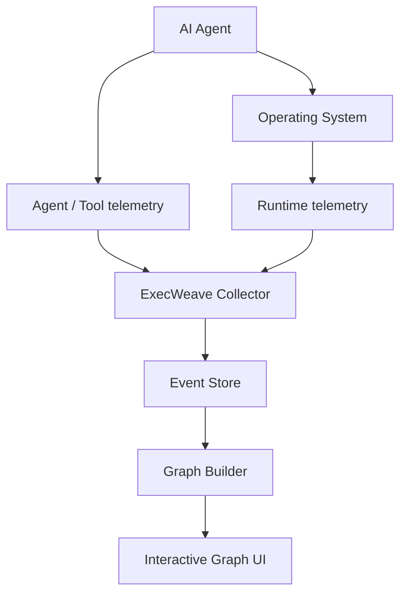

# ExecWeave

**See what AI agents actually do on your machine.**

ExecWeave is an open-source project for turning the runtime behavior of AI agents into an interactive execution graph.

Instead of reading long CLI logs or scrolling through thousands of trace events, ExecWeave aims to connect agents, processes, commands, files, network endpoints, tools, MCP servers, repositories, credentials, and other runtime resources into one understandable graph.

> **Turn opaque AI-agent execution into something humans can actually understand.**

## Current status

ExecWeave is in **early development**. Phase 1 runtime collection now has a runnable MVP.

The current collector can:

- launch an agent or arbitrary command as an ExecWeave session;
- capture the root process and discover descendant processes;
- record parent/child process relationships;
- observe filesystem changes under a selected working directory;
- observe per-process outbound network connections when the OS exposes them;
- emit all observations as graph-ready JSONL events with a shared session ID.

The interactive graph UI is **not implemented yet**.

## Quick start

Clone the repository and install it in editable mode:

```bash
git clone https://github.com/Irish-kw/ExecWeave.git
cd ExecWeave
python -m pip install -e ".[dev]"
```

Run an AI agent under ExecWeave:

```bash
execweave run -- claude
```

or:

```bash
execweave run -- codex
execweave run -- gemini
execweave run -- opencode
execweave run -- python my_agent.py
```

ExecWeave writes the local event stream to:

```text
.execweave/runs/<session-id>.jsonl
```

Choose another directory to observe:

```bash
execweave run --watch-root /path/to/project -- claude
```

Disable individual collectors while debugging:

```bash
execweave run --no-files -- claude
execweave run --no-network -- claude
```

See [`docs/phase-1-runtime-collection.md`](docs/phase-1-runtime-collection.md) for the Phase 1 design, limitations, and acceptance criteria.

## Why ExecWeave?

A modern coding agent may perform hundreds or thousands of actions during one task:

```text
read source files
→ execute shell commands
→ spawn child processes
→ install packages
→ modify code
→ access credentials
→ connect to external services
→ run tests
→ interact with Git
```

Most tools expose this as CLI output, logs, traces, or a process tree.

ExecWeave is designed around a different representation:

```text
                         ┌── READ ─────→ package.json
                         │
AI Agent ──→ Shell ──────┼── SPAWN ────→ npm
    │                    │                 │
    │                    │                 └──→ node
    │                    │
    │                    └── CONNECT ──→ registry.npmjs.org
    │
    ├── READ ───────────────→ src/app.ts
    │
    ├── WRITE ──────────────→ src/app.ts
    │
    └── Git ────────────────→ github.com
```

The goal is to answer:

> **What did this agent actually do on my machine?**

## Graph-first event model

Phase 1 does not write arbitrary log lines. Every runtime observation is represented in a graph-ready form:

```text
source --RELATION--> target
```

Examples:

```text
session --LAUNCHED--> process
process --SPAWNED--> process
process --CONNECTED_TO--> network_endpoint
session --OBSERVED_FILE_CHANGE--> file
```

A simplified event looks like:

```json
{
  "schema_version": "0.1",
  "session_id": "...",
  "event_type": "network.connection",
  "relation": "CONNECTED_TO",
  "source": {
    "type": "process",
    "id": "process:1234:1780000000000000"
  },
  "target": {
    "type": "network_endpoint",
    "id": "endpoint:github.com:443"
  }
}
```

Process IDs include both the PID and process creation time because operating systems reuse PIDs.

### Causality matters

ExecWeave should not claim more than the telemetry can prove.

The current filesystem watcher knows that a file changed during an ExecWeave session, but it cannot yet prove which process caused the change. These events therefore use:

```json
{
  "attribution": "session_observation",
  "causal": false
}
```

Future eBPF, ETW, and Endpoint Security collectors can provide stronger process-attributed edges.

## Vision

ExecWeave aims to become a **live heterogeneous runtime behavior graph for AI agents running on a single machine**.



The long-term graph can connect:

### Nodes

```text
Agent
Session
Process
Command
File
Directory
Domain
IP
Socket
Tool
MCP Server
Repository
Credential
Resource
```

### Relationships

```text
LAUNCHED
SPAWNED
EXECUTED
READ
WROTE
DELETED
CONNECTED_TO
CALLED
USED
MODIFIED
DOWNLOADED
UPLOADED
BELONGS_TO
TRIGGERED
```

## What makes ExecWeave different?

ExecWeave is not intended to be only another:

- LLM trace viewer;
- token dashboard;
- prompt observability platform;
- terminal recorder;
- process tree;
- agent workflow visualizer.

A process tree might show:

```text
agent
└── bash
    └── git
        └── ssh
```

ExecWeave ultimately wants to show the runtime relationships around those processes:

```text
                     ┌── READ ─────→ ~/.ssh/config
                     │
Agent → bash → git ──┼── USE ──────→ SSH key
                     │
                     ├── READ ─────→ repository
                     │
                     └── CONNECT ──→ github.com
```

## Roadmap

### Phase 1 — Runtime collection

Initial polling/watcher MVP:

- [x] Launch an explicit ExecWeave session
- [x] Define a graph-ready runtime event schema
- [x] Capture the root process
- [x] Discover parent/child process relationships
- [x] Observe filesystem changes
- [x] Observe outbound network connections
- [x] Correlate observations with one session ID
- [ ] Reliably capture very short-lived processes
- [ ] Process-attributed filesystem telemetry on Linux
- [ ] Process-attributed filesystem telemetry on Windows
- [ ] Process-attributed filesystem telemetry on macOS
- [ ] Runtime overhead benchmarks

### Phase 2 — Execution graph

- [ ] Build runtime events into a graph
- [ ] Entity resolution and deduplication
- [ ] Temporal graph relationships
- [ ] Graph filtering
- [ ] Query causal/runtime paths

### Phase 3 — Interactive UI

- [ ] Live graph updates
- [ ] Expand/collapse nodes
- [ ] Search processes, files, and endpoints
- [ ] Inspect node and edge details
- [ ] Timeline + graph synchronization

### Phase 4 — Agent integrations

- [ ] Claude Code
- [ ] OpenAI Codex
- [ ] Gemini CLI
- [ ] OpenCode
- [ ] MCP
- [ ] Generic agent SDK / OpenTelemetry integration

### Phase 5 — Security and analysis

- [ ] Sensitive-resource detection
- [ ] Credential access detection
- [ ] Unknown-destination detection
- [ ] Behavioral comparison
- [ ] Runtime anomaly detection
- [ ] Causal provenance
- [ ] Data-flow tracking
- [ ] Execution replay
- [ ] Runtime policy / allow / warn / block

## Platform direction

The first collector is intentionally simple so the event model can stabilize before OS-specific instrumentation becomes the foundation.

Planned telemetry sources include:

- **Linux:** eBPF, procfs, audit events
- **Windows:** ETW and Windows process/filesystem telemetry
- **macOS:** Endpoint Security, FSEvents, process telemetry
- **Agent layer:** agent SDKs, OpenTelemetry, MCP integrations

## Privacy

ExecWeave is intended to be **local-first**.

Runtime telemetry can contain sensitive information such as file paths, command-line arguments, repository names, network destinations, agent prompts, and secret-related metadata.

ExecWeave should minimize unnecessary collection, avoid transmitting telemetry outside the machine by default, and redact or hash sensitive values where possible.

## Contributing

**Contributions are very welcome.**

ExecWeave is early enough that contributors can still influence its architecture and event model.

Areas where help is especially useful:

- Linux eBPF collectors
- Windows ETW collectors
- macOS Endpoint Security collectors
- process/file/network attribution
- graph modeling and entity resolution
- interactive graph visualization
- OpenTelemetry and MCP integrations
- tests and reproducible agent workloads
- performance/overhead measurement
- security research and provenance analysis

For small changes, feel free to fork the repository and open a pull request.

For larger architecture or telemetry changes, please open an issue first and describe the platform, event source, privilege requirements, and expected graph relationships.

> **Early contributors are especially welcome.**

## Design principles

### Local first

Users should be able to inspect agent behavior without uploading sensitive runtime telemetry to a third party.

### Runtime truth over assumptions

Whenever possible, ExecWeave should visualize what actually happened on the operating system rather than only what an agent framework says happened.

### Graph over log

Logs are useful evidence, but relationships between runtime entities should be first-class data.

### Framework agnostic

ExecWeave should not depend on one model provider or agent framework.

### Explainable attribution

Users should be able to see why two nodes are connected and which raw event supports that edge.

### No fake causality

Temporal correlation should not be presented as causal attribution.

## License

See [`LICENSE`](LICENSE).

---

**Open an issue. Propose an idea. Submit a pull request. Build an integration. Challenge the architecture.**

> **Let's make AI-agent execution understandable.**
