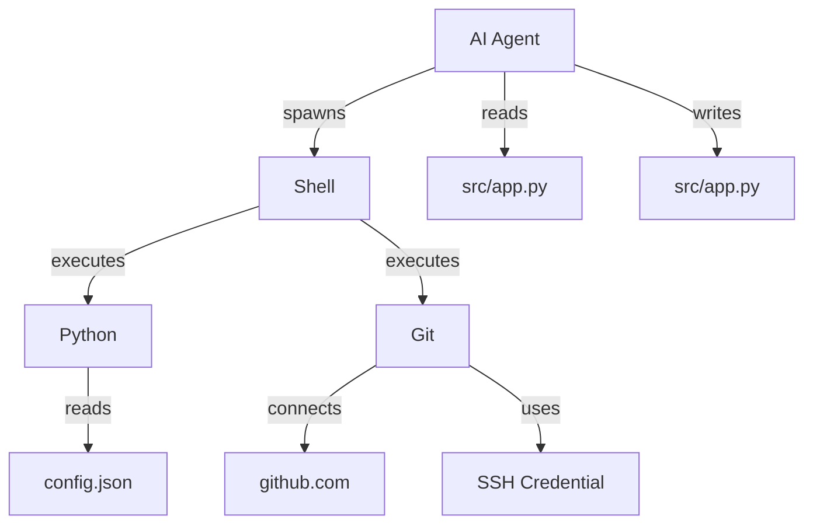
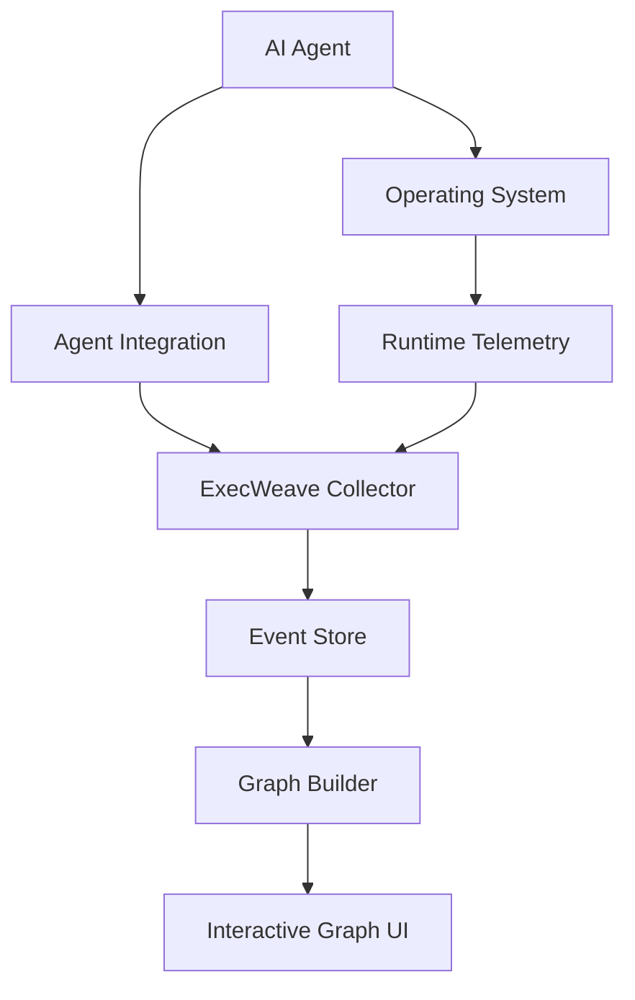

# ExecWeave

**See what AI agents actually do on your machine.**

ExecWeave is an open-source project for turning the runtime behavior of AI agents into an interactive execution graph.

Instead of reading long CLI logs or scrolling through thousands of trace events, ExecWeave aims to show how an agent interacts with your system as a graph of agents, processes, commands, files, network connections, tools, MCP servers, repositories, credentials, and other runtime resources.

> **Turn opaque AI-agent execution into something humans can actually understand.**

## Why ExecWeave?

Modern AI coding agents such as Claude Code, Codex, Gemini CLI, OpenCode, and other autonomous tools can perform increasingly complex actions on a local machine.

A single task may cause an agent to:

```text
read source files
→ execute shell commands
→ spawn child processes
→ install packages
→ modify code
→ access credentials
→ connect to external services
→ run tests
→ interact with Git
```

Most of this activity is currently exposed through CLI output, logs, traces, or linear timelines. That quickly becomes difficult to understand once an agent performs hundreds or thousands of actions.

ExecWeave explores a different interface:

```text
                         ┌── READ ─────→ package.json
                         │
AI Agent ──→ Shell ──────┼── SPAWN ────→ npm
    │                    │                 │
    │                    │                 └──→ node
    │                    │
    │                    └── CONNECT ──→ registry.npmjs.org
    │
    ├── READ ───────────────→ src/app.ts
    │
    ├── WRITE ──────────────→ src/app.ts
    │
    └── Git ────────────────→ github.com
```

Instead of asking:

> "What does this log line mean?"

we want users to be able to ask:

> **"What did this agent actually do?"**

## Vision

ExecWeave aims to build a **live runtime behavior graph for AI agents running on a single machine**.

The graph connects actions that are normally scattered across separate logs and tools.



ExecWeave is not intended to visualize only an agent's logical workflow. The long-term goal is to connect **agent-level activity with actual system-level behavior**.

```text
Agent / Tool / MCP
        ↓
Process
        ↓
File / Network / Credential / Resource
```

## What ExecWeave Wants to Capture

### Agent activity

- Agent sessions
- LLM invocations
- Tool invocations
- MCP calls
- Shell commands
- Agent-to-agent delegation

### Process activity

- Process creation
- Parent/child relationships
- Executed binaries
- Command-line arguments
- Exit status

### Filesystem activity

- Read
- Write
- Create
- Delete
- Rename
- Permission changes

### Network activity

- Outbound connections
- Domains
- IP addresses
- Ports
- Process-to-connection relationships

### Developer activity

- Git operations
- Repository changes
- Test execution
- Package installation
- Build commands

Future versions may also correlate credentials, secrets, containers, cloud resources, databases, browser activity, and remote MCP servers.

## The Execution Graph

ExecWeave models runtime activity as a heterogeneous graph rather than forcing everything into a single process tree or timeline.

### Example node types

```text
Agent
Session
Process
Command
File
Directory
Domain
IP
Socket
Tool
MCP Server
Repository
Credential
Resource
```

### Example relationships

```text
SPAWNED
EXECUTED
READ
WROTE
DELETED
CONNECTED_TO
CALLED
USED
MODIFIED
DOWNLOADED
UPLOADED
BELONGS_TO
TRIGGERED
```

For example:

```text
                    README.md
                       ↑
                      READ
                       │
Claude Code → bash → python
     │           \       │
     │            \      └── CONNECT → api.example.com
     │             \
     │              └── SPAWN → git
     │                          │
     └── WRITE → app.py         └── CONNECT → github.com
```

## What Makes ExecWeave Different?

ExecWeave is not intended to be just another:

- LLM trace viewer
- Token dashboard
- Prompt observability platform
- Process tree
- Terminal recorder
- Agent workflow visualizer

The focus is the connection between:

```text
AI Agent
   +
Operating System
   +
Runtime Resources
   =
Execution Graph
```

A process tree can tell you:

```text
agent
└── bash
    └── git
        └── ssh
```

ExecWeave wants to show:

```text
                     ┌── READ ─────→ ~/.ssh/config
                     │
Agent → bash → git ──┼── USE ──────→ SSH key
                     │
                     ├── READ ─────→ repository
                     │
                     └── CONNECT ──→ github.com
```

## Possible Use Cases

### Understand agent behavior

See which processes, files, tools, and network services an agent touched during a task.

### Debug autonomous agents

Understand why an agent executed a command or modified an unexpected resource.

### Compare agents

Compare how different AI agents solve the same task at the runtime level.

### Investigate failures

Trace a broken project back to the actions that caused it.

### Security analysis

Identify suspicious behavior such as:

```text
Agent
→ shell
→ read ~/.ssh/id_rsa
→ external connection
```

### Agent research

Study real-world execution patterns of autonomous AI systems.

## Long-Term Direction

ExecWeave may eventually support questions such as:

```text
What files did this agent modify?

Why did this process exist?

Which agent action caused this network connection?

What external services did the agent contact?

Which process accessed this credential?

What changed after this prompt?

Which actions were unusual for this agent?

How did data move from one resource to another?
```

Potential future security and analysis capabilities include:

- Behavior anomaly detection
- Sensitive-resource detection
- Attack-path reconstruction
- Causal provenance
- Data-flow tracking
- Runtime policies
- Allow / warn / block decisions
- Execution replay

But the first priority is simpler:

> **Make AI-agent runtime behavior visible.**

## Architecture

The initial architecture is expected to follow roughly this model:



Potential runtime telemetry sources include:

### Linux

- eBPF
- procfs
- audit events
- agent SDK integrations

### Windows

- ETW
- process and filesystem telemetry
- agent integrations

### macOS

- Endpoint Security
- FSEvents
- process telemetry
- agent integrations

The project will begin with a smaller supported environment before expanding across platforms.

## Project Status

**ExecWeave is currently in an early development stage.**

The project is being built openly, and the architecture is expected to evolve as we experiment with runtime collection, graph construction, attribution, and visualization.

Expect breaking changes during the early stages.

## Initial Roadmap

### Phase 1 — Runtime collection

- [ ] Detect an AI-agent session
- [ ] Capture process creation
- [ ] Capture parent/child process relationships
- [ ] Capture filesystem activity
- [ ] Capture outbound network activity
- [ ] Correlate OS activity with an agent session

### Phase 2 — Execution graph

- [ ] Define the ExecWeave event schema
- [ ] Define node and edge types
- [ ] Build runtime events into a graph
- [ ] Merge repeated entities
- [ ] Support temporal relationships
- [ ] Support graph filtering

### Phase 3 — Interactive UI

- [ ] Live graph updates
- [ ] Expand/collapse nodes
- [ ] Search processes and files
- [ ] Filter by event type
- [ ] Inspect node details
- [ ] Inspect edge details
- [ ] Trace causal paths
- [ ] Timeline + graph synchronization

### Phase 4 — Agent integrations

- [ ] Claude Code
- [ ] OpenAI Codex
- [ ] Gemini CLI
- [ ] OpenCode
- [ ] MCP
- [ ] Generic agent SDK

### Phase 5 — Security and analysis

- [ ] Sensitive file detection
- [ ] Credential access detection
- [ ] Unknown destination detection
- [ ] Behavioral comparison
- [ ] Runtime anomaly detection
- [ ] Causal provenance
- [ ] Execution replay

## Privacy

ExecWeave is intended to be **local-first**.

Runtime telemetry can contain highly sensitive information, including file paths, command-line arguments, repository names, network destinations, agent prompts, and secret-related metadata.

The project should therefore minimize unnecessary collection and avoid transmitting runtime telemetry outside the user's machine by default. Sensitive values should be redacted or hashed where possible.

## Contributing

**Contributions are very welcome.**

ExecWeave is still early, which means this is a good time to influence its architecture rather than only fix small issues after the design has already been finalized.

We welcome contributors interested in:

- AI agents
- Operating systems
- eBPF
- ETW
- macOS Endpoint Security
- Observability
- Graph systems
- Provenance
- Cybersecurity
- Frontend visualization
- Distributed tracing
- OpenTelemetry
- MCP
- Developer tools

There are many ways to contribute:

- Propose architecture ideas
- Implement telemetry collectors
- Add support for new AI agents
- Design the event schema
- Improve graph construction
- Build graph visualization
- Test on different operating systems
- Improve documentation
- Report bugs
- Propose security or research use cases

If you have an idea, feel free to open an issue or start a discussion.

You do not need to wait for the project to become mature.

> **Early contributors are especially welcome.**

### Contribution workflow

1. Fork the repository.
2. Create a feature branch.
3. Make your changes.
4. Add tests when applicable.
5. Open a pull request.
6. Describe what the change does and why it is useful.

For larger architectural changes, opening an issue first is recommended so the design can be discussed before implementation.

## Design Principles

### Local first

Users should be able to understand agent behavior without uploading sensitive machine telemetry to a third party.

### Runtime truth over assumptions

Whenever possible, ExecWeave should visualize what actually happened on the machine rather than only what the agent framework claims happened.

### Graph over log

Logs remain useful, but relationships between events should be first-class information.

### Framework agnostic

ExecWeave should not depend on a single model provider or agent framework.

### Explainable

Users should be able to understand why two nodes are connected and which raw events produced that relationship.

### Open

Core telemetry formats, graph semantics, and collectors should remain inspectable and extensible.

## Research Questions

ExecWeave is also an experimental platform for exploring several open questions:

- How should AI-agent runtime behavior be represented as a graph?
- How can agent-level actions be reliably attributed to OS-level effects?
- How should repeated files, processes, and resources be merged across time?
- How can causal relationships be distinguished from temporal correlation?
- How should multi-agent behavior be represented?
- How can runtime graphs remain understandable when an agent produces thousands of events?
- Can execution graphs reveal behavior that is difficult to identify from logs alone?

If these questions are interesting to you, contributions and discussion are welcome.

## Example

Eventually, running an agent under ExecWeave could look something like:

```bash
execweave claude
```

and produce a live graph similar to:

```text
                          ┌──────────────→ README.md
                          │ READ
                          │
Claude Code ──→ bash ─────┼──→ npm test
     │                    │       │
     │                    │       └──→ node
     │                    │
     │                    └──→ git
     │                         │
     │                         └──→ github.com
     │
     ├── READ ───────────────→ src/app.ts
     │
     └── WRITE ──────────────→ src/app.ts
```

The exact interface is still evolving.

## Community

ExecWeave is being developed in the open.

If you are interested in AI agents, runtime observability, provenance, security, graph visualization, or operating-system telemetry, you are welcome to participate.

**Open an issue. Propose an idea. Submit a pull request. Build an integration. Challenge the architecture.**

> **Let's make AI-agent execution understandable.**
