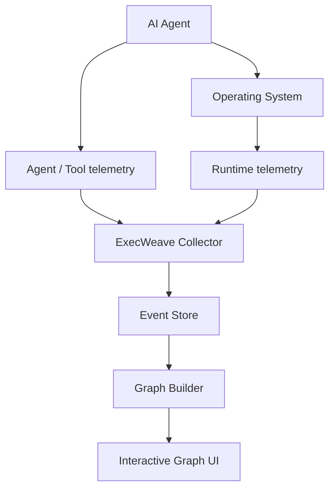

# ExecWeave

<p align="center">
  <a href="README.md">English</a> |
  <a href="README.zh-TW.md">繁體中文</a> |
  <strong>简体中文</strong> |
  <a href="README.ja.md">日本語</a> |
  <a href="README.ko.md">한국어</a>
</p>

**看清 AI Agent 在你的电脑上究竟做了什么。**

ExecWeave 是一个开源项目，目标是将 AI Agent 的 runtime 行为转换为可理解、可交互的 execution graph（执行图）。

与其阅读冗长的 CLI 输出或在数千条 trace event 中滚动，ExecWeave 希望把 Agent、process、command、file、network endpoint、tool、MCP server、repository、credential 与其他 runtime resource 连接成一张可直接理解的图。

> **把不透明的 AI Agent 执行过程，变成人类真正看得懂的东西。**

## 当前状态

ExecWeave 仍处于 **早期开发阶段**。Phase 1 runtime collection 已经有可运行的 MVP。

当前 collector 可以：

- 将 Agent 或任意 command 启动为一个 ExecWeave session；
- 捕获 root process 并发现 descendant processes；
- 记录 parent/child process 关系；
- 监控指定工作目录下的 filesystem 变化；
- 在操作系统允许时观察各 process 的 outbound network connection；
- 将所有 observation 输出为共享同一 session ID 的 graph-ready JSONL events。

目前 **尚未实现 interactive graph UI**。

## 快速开始

Clone repository 并以 editable mode 安装：

```bash
git clone https://github.com/Irish-kw/ExecWeave.git
cd ExecWeave
python -m pip install -e ".[dev]"
```

在 ExecWeave 下运行 AI Agent：

```bash
execweave run -- claude
```

也可以：

```bash
execweave run -- codex
execweave run -- gemini
execweave run -- opencode
execweave run -- python my_agent.py
```

ExecWeave 会把本地 event stream 写入：

```text
.execweave/runs/<session-id>.jsonl
```

指定其他观察目录：

```bash
execweave run --watch-root /path/to/project -- claude
```

调试时可以禁用单独的 collector：

```bash
execweave run --no-files -- claude
execweave run --no-network -- claude
```

Phase 1 的设计、限制与 acceptance criteria 请参见 [`docs/phase-1-runtime-collection.md`](docs/phase-1-runtime-collection.md)。

## 为什么需要 ExecWeave？

现代 coding agent 在一次任务中可能执行数百甚至数千个动作：

```text
读取源代码
→ 执行 shell command
→ 创建 child process
→ 安装 package
→ 修改代码
→ 访问 credential
→ 连接外部服务
→ 执行测试
→ 操作 Git
```

多数工具仍以 CLI output、log、trace 或 process tree 呈现这些行为。

ExecWeave 希望使用另一种表示方式：

```text
                         ┌── READ ─────→ package.json
                         │
AI Agent ──→ Shell ──────┼── SPAWN ────→ npm
    │                    │                 │
    │                    │                 └──→ node
    │                    │
    │                    └── CONNECT ──→ registry.npmjs.org
    │
    ├── READ ───────────────→ src/app.ts
    │
    ├── WRITE ──────────────→ src/app.ts
    │
    └── Git ────────────────→ github.com
```

我们想回答的是：

> **这个 Agent 刚才在我的电脑上，究竟做了什么？**

## Graph-first event model

Phase 1 不只是写任意格式的 log line。每一条 runtime observation 都以可直接构图的形式表示：

```text
source --RELATION--> target
```

例如：

```text
session --LAUNCHED--> process
process --SPAWNED--> process
process --CONNECTED_TO--> network_endpoint
session --OBSERVED_FILE_CHANGE--> file
```

简化后的 event 示例：

```json
{
  "schema_version": "0.1",
  "session_id": "...",
  "event_type": "network.connection",
  "relation": "CONNECTED_TO",
  "source": {
    "type": "process",
    "id": "process:1234:1780000000000000"
  },
  "target": {
    "type": "network_endpoint",
    "id": "endpoint:github.com:443"
  }
}
```

Process ID 同时包含 PID 与 process creation time，因为操作系统会重复使用 PID。

### 因果关系很重要

ExecWeave 不应声称 telemetry 无法证明的事情。

当前 filesystem watcher 能知道某个文件在 ExecWeave session 期间发生变化，但还不能证明由哪个 process 导致。因此这类 event 会明确标记：

```json
{
  "attribution": "session_observation",
  "causal": false
}
```

未来 eBPF、ETW 与 Endpoint Security collectors 可以提供更强的 process-attributed edges。

## 愿景

ExecWeave 的目标是成为针对单台电脑上 AI Agent 的 **实时 heterogeneous runtime behavior graph（异构运行时行为图）**。



长期 Graph 可以连接：

### Nodes

```text
Agent
Session
Process
Command
File
Directory
Domain
IP
Socket
Tool
MCP Server
Repository
Credential
Resource
```

### Relationships

```text
LAUNCHED
SPAWNED
EXECUTED
READ
WROTE
DELETED
CONNECTED_TO
CALLED
USED
MODIFIED
DOWNLOADED
UPLOADED
BELONGS_TO
TRIGGERED
```

## ExecWeave 有什么不同？

ExecWeave 不打算只成为另一个：

- LLM trace viewer；
- token dashboard；
- prompt observability platform；
- terminal recorder；
- process tree；
- Agent workflow visualizer。

一般 process tree 可能只会显示：

```text
agent
└── bash
    └── git
        └── ssh
```

ExecWeave 最终希望呈现这些 process 周围真实的 runtime relationship：

```text
                     ┌── READ ─────→ ~/.ssh/config
                     │
Agent → bash → git ──┼── USE ──────→ SSH key
                     │
                     ├── READ ─────→ repository
                     │
                     └── CONNECT ──→ github.com
```

## Roadmap

### Phase 1 — Runtime collection

初始 polling/watcher MVP：

- [x] 启动明确的 ExecWeave session
- [x] 定义 graph-ready runtime event schema
- [x] 捕获 root process
- [x] 发现 parent/child process relationship
- [x] 观察 filesystem changes
- [x] 观察 outbound network connections
- [x] 将 observation 关联到同一 session ID
- [ ] 稳定捕获生命周期极短的 process
- [ ] Linux process-attributed filesystem telemetry
- [ ] Windows process-attributed filesystem telemetry
- [ ] macOS process-attributed filesystem telemetry
- [ ] Runtime overhead benchmark

### Phase 2 — Execution graph

- [ ] 将 runtime events 构建为 Graph
- [ ] Entity resolution 与 deduplication
- [ ] Temporal graph relationships
- [ ] Graph filtering
- [ ] 查询 causal/runtime paths

### Phase 3 — Interactive UI

- [ ] Live graph updates
- [ ] Node expand/collapse
- [ ] 搜索 process、file 与 endpoint
- [ ] 查看 node 与 edge 细节
- [ ] Timeline + graph synchronization

### Phase 4 — Agent integrations

- [ ] Claude Code
- [ ] OpenAI Codex
- [ ] Gemini CLI
- [ ] OpenCode
- [ ] MCP
- [ ] Generic agent SDK / OpenTelemetry integration

### Phase 5 — Security and analysis

- [ ] Sensitive-resource detection
- [ ] Credential access detection
- [ ] Unknown-destination detection
- [ ] Behavioral comparison
- [ ] Runtime anomaly detection
- [ ] Causal provenance
- [ ] Data-flow tracking
- [ ] Execution replay
- [ ] Runtime policy / allow / warn / block

## 平台方向

第一版 collector 故意保持简单，让 event model 先稳定，再逐步让 OS-specific instrumentation 成为底层基础。

计划中的 telemetry sources 包括：

- **Linux：** eBPF、procfs、audit events
- **Windows：** ETW 与 Windows process/filesystem telemetry
- **macOS：** Endpoint Security、FSEvents、process telemetry
- **Agent layer：** agent SDK、OpenTelemetry、MCP integrations

## 隐私

ExecWeave 的设计方向是 **local-first**。

Runtime telemetry 可能包含敏感信息，例如 file path、command-line argument、repository name、network destination、Agent prompt 与 secret-related metadata。

ExecWeave 应尽量减少不必要的数据采集，默认不把 telemetry 传离用户电脑，并在可能时对敏感值进行 redact 或 hash。

## Contributing

**非常欢迎大家一起贡献 ExecWeave。**

ExecWeave 仍足够早期，因此 contributor 不只是修小 bug，也能直接参与 architecture 与 event model 的设计。

目前特别需要帮助的方向：

- Linux eBPF collectors
- Windows ETW collectors
- macOS Endpoint Security collectors
- process/file/network attribution
- graph modeling 与 entity resolution
- interactive graph visualization
- OpenTelemetry 与 MCP integrations
- 测试与 reproducible agent workloads
- performance / overhead measurement
- security research 与 provenance analysis
- README 与文档翻译

小型修改可以直接 fork repository 并提交 pull request。

较大的 architecture 或 telemetry 修改，建议先开 issue，说明平台、event source、权限需求以及预期的 graph relationship。

### README 多语言翻译

`README.md` 是 canonical English source。其他语言 README 使用 locale-qualified filename，例如 `README.zh-TW.md`、`README.zh-CN.md`、`README.ja.md`、`README.ko.md`。

欢迎协助新增其他语言。请尽量保持章节结构、code example、link、roadmap 状态和技术含义与英文 README 同步。

> **特别欢迎早期 contributor 加入。**

## 设计原则

### Local first

用户应能在不把敏感 runtime telemetry 上传给第三方的情况下理解 Agent 行为。

### Runtime truth over assumptions

只要 telemetry 能做到，ExecWeave 应优先呈现操作系统上真实发生的事情，而不是只相信 Agent framework 声称发生了什么。

### Graph over log

Log 是重要 evidence，但 runtime entity 之间的 relationship 应是一等数据。

### Framework agnostic

ExecWeave 不应绑定单一 model provider 或 Agent framework。

### Explainable attribution

用户应能知道为什么两个 node 被连接，以及哪条 raw event 支持这条 edge。

### No fake causality

时间相关性不能被包装成因果关系。

## License

请参见 [`LICENSE`](LICENSE)。

---

**开 Issue。提出想法。提交 Pull Request。构建 Integration。挑战现有 Architecture。**

> **一起让 AI Agent 的执行行为真正变得可理解。**
