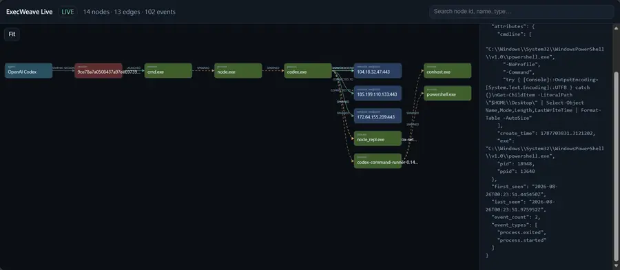

# ExecWeave

<!-- i18n-nav:start -->
<p align="center">
  <a href="README.md">English</a> |
  <a href="README.zh-TW.md">繁體中文</a> |
  <strong>简体中文</strong> |
  <a href="README.ja.md">日本語</a> |
  <a href="README.ko.md">한국어</a> |
  <a href="README.fr.md">Français</a> |
  <a href="README.de.md">Deutsch</a> |
  <a href="README.ru.md">Русский</a>
</p>
<!-- i18n-nav:end -->

**看见 AI Agent 在你的电脑上实际做了什么。**

ExecWeave 是开源、local-first 的 observability 项目，将 AI Agent 活动转换为互动式 execution graph，同时明确区分 observed evidence 与 inference。

> **Event 是 ground truth；Graph 是 materialized view。**

<p align="center">
  
</p>

<!-- execweave-demo:start -->
## 复现这个 Demo

上面的截图来自一个真实的 ExecWeave v0.6.3 live session。这个 workload 会刻意产生足够多种活动，让 execution graph 能清楚展示效果：多个 Python modules、JSON/CSV 文件、tests、文件检查，以及对外 HTTP requests。

把本地 Agent CLI 放在 ExecWeave 下运行，例如：

```bash
execweave live --open -- claude
```

然后把这段 workload prompt 发送给 Agent：

```text
Create a small Python project in ./execweave-demo with 8 modules,
generate sample JSON and CSV data, run the program and tests,
inspect the generated files, and fetch example.com plus the GitHub API.
```

同一个 workload 也可以用于 `codex`、`gemini`、`cursor` 或 `opencode`。实际的 node、edge、event、process 和 endpoint 数量会随 OS、Agent 版本和环境而变化。ExecWeave 记录的是实际观察到的 runtime evidence；上图只是一次具体运行结果，不是固定预期 graph。
<!-- execweave-demo:end -->

## 安装

ExecWeave 已正式发布到 PyPI。安装最新已发布版本：

```bash
python -m pip install -U execweave
```

`main` 可能比当前 PyPI release 更新。若要直接测试最新 mainline：

```bash
python -m pip install --upgrade --force-reinstall "execweave @ git+https://github.com/Irish-kw/ExecWeave.git@main"
```

开发安装：

```bash
git clone https://github.com/Irish-kw/ExecWeave.git
cd ExecWeave
python -m pip install -e ".[dev]"
```

Live OS-runtime telemetry 可用于 **任何本地 command**；下面只是示例，不是 whitelist：

```bash
# Agent / IDE CLI
execweave live --open -- claude
execweave live --open -- codex
execweave live --open -- gemini
execweave live --open -- cursor
execweave live --open -- opencode

# 任意本地程序
execweave live --open -- python my_agent.py

# 由 ExecWeave 启动的本地 model runtime
execweave live --open -- ollama serve
```

`execweave live` 实时呈现它所启动 command tree 的 process、file、network evidence。Agent semantic hooks、model-runtime API metadata、inference-gateway routing metadata **目前不会自动注入 Live Viewer**。

#### Live 能力矩阵

| Integration | 直接 OS-runtime live | 专用 metadata | 自动进入 Live Viewer |
| --- | --- | --- | --- |
| Claude Code | 可以 | `execweave-claude-record` / hooks | 否 |
| OpenAI Codex | 可以 | `execweave-codex-record` / hooks | 否 |
| Gemini CLI | 可以 | `execweave-gemini-record` / hooks | 否 |
| Cursor | 可以 | `execweave-cursor-record` / hooks | 否 |
| OpenCode | 可以 | `execweave-opencode-record` / plugin | 否 |
| Ollama | 可以，但需由 ExecWeave 启动，例如 `ollama serve` | `execweave-model-runtime event/probe --runtime ollama` | 否 |
| llama.cpp | 可以，但需由 ExecWeave 启动本地 server | `execweave-model-runtime event/probe --runtime llamacpp` | 否 |
| vLLM | 可以，但需由 ExecWeave 启动本地 server | `execweave-model-runtime event/probe --runtime vllm` | 否 |
| LM Studio | 仅限由 ExecWeave 启动的本地 process；不会 attach 已运行的 server | `execweave-model-runtime event/probe --runtime lmstudio` | 否 |
| LiteLLM Proxy | 可以，但需由 ExecWeave 启动本地 proxy | `execweave-inference-gateway event --gateway litellm` | 否 |
| OpenRouter | 远程服务本身不能直接 live；请 live 本地 client/Agent | `execweave-inference-gateway event/generation --gateway openrouter` | 否 |

如果 Ollama 已在后台运行，可用 `execweave-model-runtime probe --runtime ollama` snapshot 当前 loaded-model state。OpenRouter 可由 `live` 观察本地 client 与 network activity，而 gateway routing/usage metadata 仍保持为独立 evidence layer。

<!-- v0.6.3-live -->
### v0.6.3 实时可观测性

同一个 live session 可以使用浏览器或 Terminal 查看：

```bash
execweave top -- codex          # Terminal dashboard
execweave top --open -- codex   # Terminal + Web Viewer
```

Live 更新改用增量 snapshot/delta 与有界历史，不再反复重建并传输整张 graph。Live 与 standalone Viewer 都支持会记住偏好的 Dark/Light 切换。在 Linux 上，超大型 recursive filesystem scope 会先进行资源预检；如果 inotify watch 空间不足，会自动降级为 polling，因此不会因 inotify watch exhaustion 直接终止 session。

`live` 是通用 OS-runtime view，不是 integration whitelist。Agent semantic、model-runtime、gateway metadata 仍是分离的 evidence layers，在 v0.6.3 不会自动注入 Live Viewer。

可用 `execweave-scalability` 重现 graph scalability benchmark；CI 覆盖 10k、100k 和 1M synthetic events。

#### Scalability benchmark

以下为 GitHub Actions 上 incremental `GraphAccumulator` synthetic workload 的 reference result（`retain_event_ids=False`）：

| Events | Apply time | Throughput | Nodes | Edges | Apply RSS Δ | Snapshot |
| ---: | ---: | ---: | ---: | ---: | ---: | ---: |
| 10k | 0.114 s | 87,681 ev/s | 10,001 | 10,000 | 35.9 MiB | 8.5 MiB |
| 100k | 0.654 s | 152,816 ev/s | 10,001 | 10,000 | 25.8 MiB | 8.6 MiB |
| **1M** | **6.087 s** | **164,273 ev/s** | **10,001** | **10,000** | **23.5 MiB** | **8.6 MiB** |

在 **1,000,000 events** 下，incremental in-memory graph 不会重复保存 raw event IDs；raw evidence 与 materialized graph 保持分离。这个 benchmark 测量的是 graph accumulation 与 snapshot materialization，不是 end-to-end collector 或 browser throughput。

## 性能与空间占用

Reference benchmark 从实际安装的 wheel 运行。图采用常见的 trade-off 表达：X 轴为额外 peak process-tree RSS（低→高），Y 轴为 runtime overhead（低→高），bubble 面积表示每次 run 的 median artifact size；左下角更理想。


Reference 环境：GitHub Actions Ubuntu runner、Intel Xeon Platinum 8573C、4 logical CPUs、Python 3.12.14、`n=7`。

| Profile | Median wall time | Runtime overhead | 额外 peak RSS | Median artifacts/run |
| --- | ---: | ---: | ---: | ---: |
| ExecWeave OFF | 236.221 ms | 0.0% | 0.0 MB | 0 KB |
| Portable ON | 391.580 ms | 65.768% | 27.852 MB | 741.355 KB |
| Strace ON | 1226.076 ms | 419.038% | 37.653 MB | 572.838 KB |

同一 build 产生约 **113 KB wheel**、**198 KB sdist**；安装后的 ExecWeave distribution 本身约 **849 KB**，不包含 Python 与 dependency footprint。

这是一个很短、file/process-heavy 的 **reference microbenchmark**，不是所有 Agent workload 的普遍 overhead 结论。部署或容量评估前应在目标主机与真实 workload 上重新运行：

```bash
execweave-overhead --iterations 7 --strace auto \
  --output-json benchmark-results.json \
  --output-svg benchmark-overhead.svg
```

原始数据与方法：[`docs/benchmarks/`](docs/benchmarks/)。

## Evidence layers

```text
Agent / IDE semantic evidence
          ↓
Inference gateway / routing evidence
          ↓
Model runtime / inference-server evidence
          ↓
OS runtime evidence: process / file / network
```

只有底层 telemetry 能直接支持时，relationship 才会标记为 causal。

## Integrations

Agent / IDE：Claude Code、OpenAI Codex、Gemini CLI、Cursor、OpenCode。

Inference Gateway：OpenRouter、LiteLLM Proxy。Requested model、resolved model、provider、deployment 分开保存，没有 authoritative metadata 时不推测 routing facts。

Model Runtime：Ollama、llama.cpp、vLLM、LM Studio。Prompt、generated content、reasoning content 不保存；敏感 local model path 会 redaction。LM Studio catalog 使用 `ADVERTISES_MODEL`，不会把 catalog visibility 当成 loaded-memory evidence。

Tool → Process correlation 始终保持：

```text
inferred: true
causal: false
```

ambiguous / no-match 不建立 edge。

若 Gateway 与 Model Runtime 拥有明确 shared request identity，可建立 `SAME_INFERENCE_REQUEST`：

```text
identity_exact: true
inferred: false
causal: false
```

Raw shared ID 不落盘，仅保存 SHA-256-derived identity hash。

## Runtime evidence

Portable collector 支持 Linux、macOS、Windows；Linux 另有 syscall-backed `strace` reference backend。

```bash
execweave doctor
execweave run --backend portable -- your-command
execweave run --backend strace -- your-command
```

从 v0.6.1 开始，所有 recorder 在启动 child command 前都会使用共享的跨平台 launcher resolver。Linux / macOS 保持正常 PATH executable 行为；Windows 通过 PATH/PATHEXT 正确解析 `.exe`、`.cmd`、`.bat`，显式 `.ps1` 则交给 PowerShell 启动。专用 Windows CI 会从 `cmd.exe` 和 Windows PowerShell 实际启动 Codex / Cursor recorder；完整 Cursor semantic/correlation integration 同时由 Windows、macOS、Ubuntu matrix 覆盖。

Portable filesystem observation 是 session-correlated，不是 process-causal。未来 native collectors 包括 Linux eBPF、Windows ETW、macOS Endpoint Security。

## v0.6.3 Safety Patch

v0.6.3 提升长时间与高 cardinality session 的资源安全，但**不改变 evidence semantics 或 graph schema 0.1**：

- 对 filesystem root、用户 home、users-home parent 等过宽 recursive scope，不再直接进行 recursive filesystem observation；process、network、semantic collection 仍可继续。
- Standalone 与 Live Viewer 超过安全预算（1,500 nodes、4,000 edges，或估算 5,000 SVG elements）后停止 SVG materialization，避免大型 graph 耗尽浏览器内存；canonical `graph.json` evidence artifact 仍保持完整。
- Viewer layout/fit 不再把任意大型 array spread 到 `Math.min` / `Math.max`，node dragging 的 edge redraw 采用 animation-frame throttling。
- Live server 通过 byte offset 只 tail `events.jsonl` 新增 bytes，并由 in-memory `GraphAccumulator` 增量更新；每次 `/graph.json` 不再重播完整 event history，未完成且没有 newline 的 trailing JSONL line 会先 buffer。
- 只有 event count / aggregate count 变化时，Live UI 只更新 stats/edge labels，不重新绘制整个 topology。超过 Viewer 预算后，live `/graph.json` 返回 counts-only compact payload；collection 与 session 结束时的 canonical validation/full `graph.json` 不受影响。

这是 polling + incremental ingestion 的 Safety Patch，不是 SSE、SQLite、Rust 或 Canvas 架构切换。

## Viewer / Graph / Security

Standalone Viewer 完全 local、自包含，支持 pan/zoom、inspection、filters、**observed only**、search、Timeline replay、cluster expansion、focused neighborhood、Saved Views 与明确 edge semantics。

```bash
execweave graph-summary run.graph.json
execweave graph-focus run.graph.json NODE_ID --hops 2 --output focused.graph.json
execweave analyze run.graph.json --output analysis.json
```

Security findings 会保留 evidence limits；possible sensitive-file → network path 不等于 byte-level exfiltration。

## 当前状态

ExecWeave `main` 当前为 **v0.6.3**，baseline 已包含 runtime collection、execution graph、五种 Agent/IDE integrations、OpenRouter/LiteLLM、Ollama/llama.cpp/vLLM/LM Studio、exact Gateway ↔ Runtime identity、已发布的 PyPI packaging、reference overhead benchmark、cross-platform command launcher compatibility、large-graph browser safety guards、incremental Live JSONL tail/cache 与 cross-platform CI。

## 隐私

ExecWeave 是 local-first。Runtime events、semantic sidecars、graphs、reports 与 Viewers 默认留在本机。项目不刻意采集 file content 或 raw read/write buffers；分享 artifacts 前请检查 command、path、endpoint、identifier 与 model metadata。

## 文档

- [`Phase 1 — Runtime Collection`](docs/phase-1-runtime-collection.zh-CN.md)
- [`Phase 2 — Execution Graph`](docs/phase-2-execution-graph.zh-CN.md)
- [`Semantic Telemetry`](docs/semantic-telemetry.zh-CN.md)
- [`Inference Gateway`](docs/inference-gateway.zh-CN.md)
- [`Model Runtime`](docs/model-runtime.zh-CN.md)
- [`Performance Benchmarks`](docs/benchmarks/README.md)
- [`Security Analysis`](docs/security-analysis.zh-CN.md)

## License

请参阅 [`LICENSE`](LICENSE)。