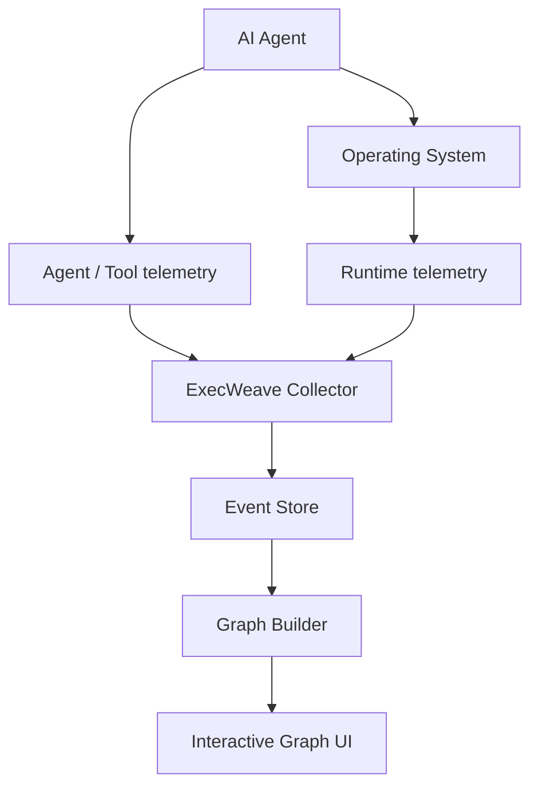

# ExecWeave

<p align="center">
  <a href="README.md">English</a> |
  <strong>繁體中文</strong> |
  <a href="README.zh-CN.md">简体中文</a> |
  <a href="README.ja.md">日本語</a> |
  <a href="README.ko.md">한국어</a>
</p>

**看清楚 AI Agent 在你的電腦上實際做了什麼。**

ExecWeave 是一個開源專案，目標是把 AI Agent 的 runtime 行為轉換成可理解、可互動的 execution graph（執行圖）。

與其閱讀冗長的 CLI 輸出或在數千筆 trace event 中捲動，ExecWeave 希望把 Agent、process、command、file、network endpoint、tool、MCP server、repository、credential 與其他 runtime resource 串成一張可以直接理解的圖。

> **把不透明的 AI Agent 執行過程，變成人類真正看得懂的東西。**

## 目前狀態

ExecWeave 目前仍處於 **早期開發階段**。Phase 1 runtime collection 已經有可執行的 MVP。

目前 collector 可以：

- 將 Agent 或任意 command 啟動成一個 ExecWeave session；
- 擷取 root process 並發現其 descendant processes；
- 記錄 parent/child process 關係；
- 監控指定工作目錄下的 filesystem 變更；
- 在作業系統允許的情況下觀察各 process 的 outbound network connection；
- 將所有 observation 輸出成共用同一個 session ID 的 graph-ready JSONL events。

目前 **尚未實作 interactive graph UI**。

## 快速開始

Clone repository 並以 editable mode 安裝：

```bash
git clone https://github.com/Irish-kw/ExecWeave.git
cd ExecWeave
python -m pip install -e ".[dev]"
```

在 ExecWeave 下執行 AI Agent：

```bash
execweave run -- claude
```

也可以：

```bash
execweave run -- codex
execweave run -- gemini
execweave run -- opencode
execweave run -- python my_agent.py
```

ExecWeave 會將本地 event stream 寫入：

```text
.execweave/runs/<session-id>.jsonl
```

指定其他觀察目錄：

```bash
execweave run --watch-root /path/to/project -- claude
```

除錯時可以停用個別 collector：

```bash
execweave run --no-files -- claude
execweave run --no-network -- claude
```

Phase 1 的設計、限制與 acceptance criteria 請參考 [`docs/phase-1-runtime-collection.md`](docs/phase-1-runtime-collection.md)。

## 為什麼需要 ExecWeave？

現代 coding agent 在一次任務中可能執行數百甚至數千個動作：

```text
讀取原始碼
→ 執行 shell command
→ 建立 child process
→ 安裝 package
→ 修改程式碼
→ 存取 credential
→ 連線外部服務
→ 執行測試
→ 操作 Git
```

多數工具目前仍以 CLI output、log、trace 或 process tree 呈現這些行為。

ExecWeave 希望用另一種方式表示：

```text
                         ┌── READ ─────→ package.json
                         │
AI Agent ──→ Shell ──────┼── SPAWN ────→ npm
    │                    │                 │
    │                    │                 └──→ node
    │                    │
    │                    └── CONNECT ──→ registry.npmjs.org
    │
    ├── READ ───────────────→ src/app.ts
    │
    ├── WRITE ──────────────→ src/app.ts
    │
    └── Git ────────────────→ github.com
```

我們想回答的是：

> **這個 Agent 剛剛在我的電腦上，到底做了什麼？**

## Graph-first event model

Phase 1 不會只寫任意格式的 log line。每一筆 runtime observation 都會以可直接建立 Graph 的形式表示：

```text
source --RELATION--> target
```

例如：

```text
session --LAUNCHED--> process
process --SPAWNED--> process
process --CONNECTED_TO--> network_endpoint
session --OBSERVED_FILE_CHANGE--> file
```

簡化後的 event 範例：

```json
{
  "schema_version": "0.1",
  "session_id": "...",
  "event_type": "network.connection",
  "relation": "CONNECTED_TO",
  "source": {
    "type": "process",
    "id": "process:1234:1780000000000000"
  },
  "target": {
    "type": "network_endpoint",
    "id": "endpoint:github.com:443"
  }
}
```

Process ID 同時包含 PID 與 process creation time，因為作業系統會重複使用 PID。

### 因果關係很重要

ExecWeave 不應宣稱 telemetry 無法證明的事情。

目前 filesystem watcher 能知道某個檔案在 ExecWeave session 期間發生改變，但還不能證明是哪個 process 造成變更。因此這類 event 會明確標記：

```json
{
  "attribution": "session_observation",
  "causal": false
}
```

未來 eBPF、ETW 與 Endpoint Security collectors 可以提供更強的 process-attributed edges。

## 願景

ExecWeave 的目標是成為一個針對單一電腦上 AI Agent 的 **即時 heterogeneous runtime behavior graph（異質執行行為圖）**。



長期的 Graph 可以連接：

### Nodes

```text
Agent
Session
Process
Command
File
Directory
Domain
IP
Socket
Tool
MCP Server
Repository
Credential
Resource
```

### Relationships

```text
LAUNCHED
SPAWNED
EXECUTED
READ
WROTE
DELETED
CONNECTED_TO
CALLED
USED
MODIFIED
DOWNLOADED
UPLOADED
BELONGS_TO
TRIGGERED
```

## ExecWeave 有什麼不同？

ExecWeave 不打算只成為另一個：

- LLM trace viewer；
- token dashboard；
- prompt observability platform；
- terminal recorder；
- process tree；
- Agent workflow visualizer。

一般 process tree 可能只會看到：

```text
agent
└── bash
    └── git
        └── ssh
```

ExecWeave 最終希望呈現的是這些 process 周圍真正的 runtime relationship：

```text
                     ┌── READ ─────→ ~/.ssh/config
                     │
Agent → bash → git ──┼── USE ──────→ SSH key
                     │
                     ├── READ ─────→ repository
                     │
                     └── CONNECT ──→ github.com
```

## Roadmap

### Phase 1 — Runtime collection

初始 polling/watcher MVP：

- [x] 啟動明確的 ExecWeave session
- [x] 定義 graph-ready runtime event schema
- [x] 擷取 root process
- [x] 發現 parent/child process relationship
- [x] 觀察 filesystem changes
- [x] 觀察 outbound network connections
- [x] 將 observation 關聯到同一個 session ID
- [ ] 穩定捕捉極短生命週期 process
- [ ] Linux process-attributed filesystem telemetry
- [ ] Windows process-attributed filesystem telemetry
- [ ] macOS process-attributed filesystem telemetry
- [ ] Runtime overhead benchmark

### Phase 2 — Execution graph

- [ ] 將 runtime events 建成 Graph
- [ ] Entity resolution 與 deduplication
- [ ] Temporal graph relationships
- [ ] Graph filtering
- [ ] 查詢 causal/runtime paths

### Phase 3 — Interactive UI

- [ ] Live graph updates
- [ ] Node expand/collapse
- [ ] 搜尋 process、file 與 endpoint
- [ ] 檢視 node 與 edge 細節
- [ ] Timeline + graph synchronization

### Phase 4 — Agent integrations

- [ ] Claude Code
- [ ] OpenAI Codex
- [ ] Gemini CLI
- [ ] OpenCode
- [ ] MCP
- [ ] Generic agent SDK / OpenTelemetry integration

### Phase 5 — Security and analysis

- [ ] Sensitive-resource detection
- [ ] Credential access detection
- [ ] Unknown-destination detection
- [ ] Behavioral comparison
- [ ] Runtime anomaly detection
- [ ] Causal provenance
- [ ] Data-flow tracking
- [ ] Execution replay
- [ ] Runtime policy / allow / warn / block

## 平台方向

第一版 collector 刻意保持簡單，讓 event model 先穩定，再逐步讓 OS-specific instrumentation 成為底層基礎。

規劃中的 telemetry sources 包括：

- **Linux：** eBPF、procfs、audit events
- **Windows：** ETW 與 Windows process/filesystem telemetry
- **macOS：** Endpoint Security、FSEvents、process telemetry
- **Agent layer：** agent SDK、OpenTelemetry、MCP integrations

## 隱私

ExecWeave 的設計方向是 **local-first**。

Runtime telemetry 可能包含敏感資訊，例如 file path、command-line argument、repository name、network destination、Agent prompt 與 secret-related metadata。

ExecWeave 應盡量減少不必要的資料蒐集，預設不將 telemetry 傳離使用者電腦，並在可能的情況下對敏感值進行 redact 或 hash。

## Contributing

**非常歡迎大家一起貢獻 ExecWeave。**

ExecWeave 還處在足夠早期的階段，因此 contributor 不只是修小 bug，也能直接參與 architecture 與 event model 的設計。

目前特別需要協助的方向：

- Linux eBPF collectors
- Windows ETW collectors
- macOS Endpoint Security collectors
- process/file/network attribution
- graph modeling 與 entity resolution
- interactive graph visualization
- OpenTelemetry 與 MCP integrations
- 測試與 reproducible agent workloads
- performance / overhead measurement
- security research 與 provenance analysis
- README 與文件翻譯

小型修改可以直接 fork repository 並提出 pull request。

較大的 architecture 或 telemetry 修改，建議先開 issue，描述平台、event source、需要的權限，以及預期產生的 graph relationship。

### README 多語言翻譯

`README.md` 是 canonical English source。其他語言 README 使用 locale-qualified filename，例如 `README.zh-TW.md`、`README.zh-CN.md`、`README.ja.md`、`README.ko.md`。

歡迎協助新增其他語言。請盡可能保持章節結構、code example、link、roadmap 狀態與技術語意和英文 README 同步。

> **特別歡迎早期 contributor 一起加入。**

## 設計原則

### Local first

使用者應該可以在不把敏感 runtime telemetry 上傳到第三方的情況下理解 Agent 行為。

### Runtime truth over assumptions

只要 telemetry 能做到，ExecWeave 應優先呈現作業系統上真正發生的事情，而不是只相信 Agent framework 聲稱發生了什麼。

### Graph over log

Log 是重要 evidence，但 runtime entity 之間的 relationship 應該是一等資料。

### Framework agnostic

ExecWeave 不應綁定單一 model provider 或 Agent framework。

### Explainable attribution

使用者應該能知道為什麼兩個 node 被連在一起，以及是哪一筆 raw event 支援這條 edge。

### No fake causality

時間上的相關性不能被包裝成因果關係。

## License

請參考 [`LICENSE`](LICENSE)。

---

**開 Issue。提出想法。送 Pull Request。建立 Integration。挑戰現有 Architecture。**

> **一起讓 AI Agent 的執行行為真正變得看得懂。**
